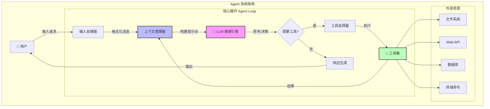
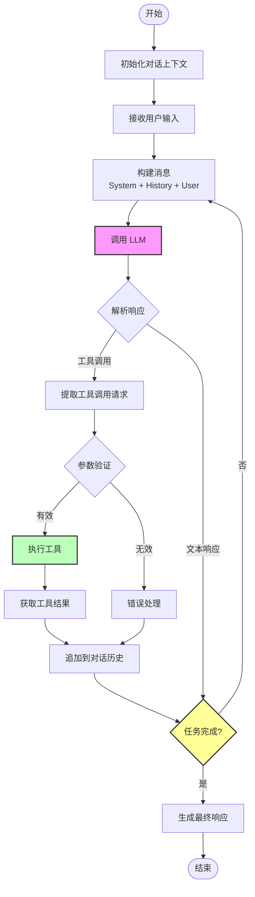
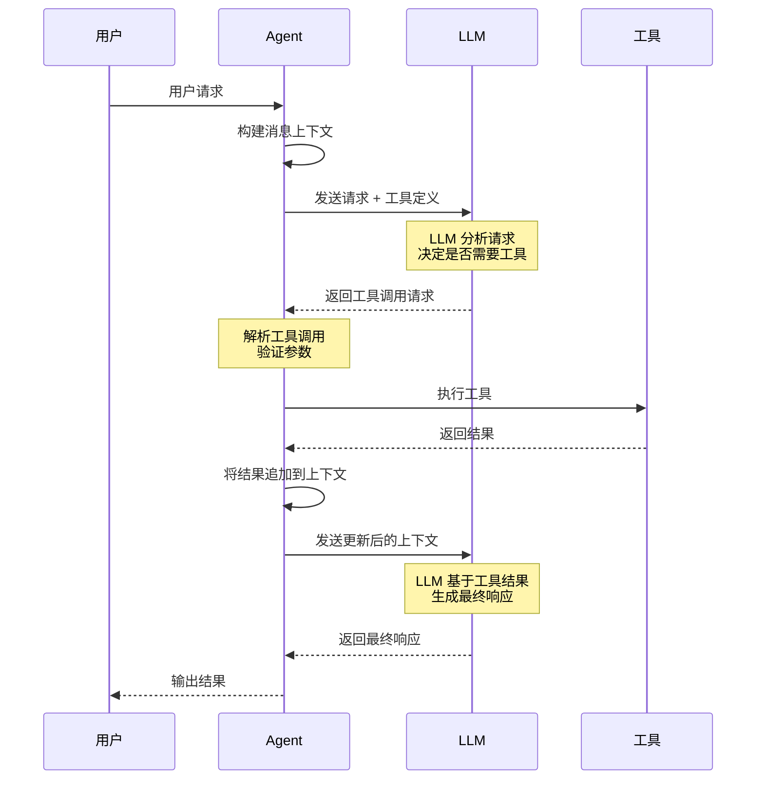
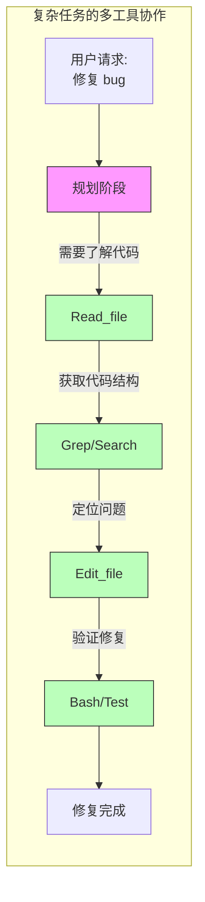
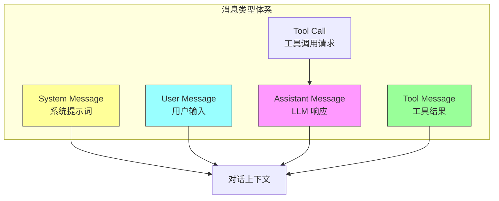
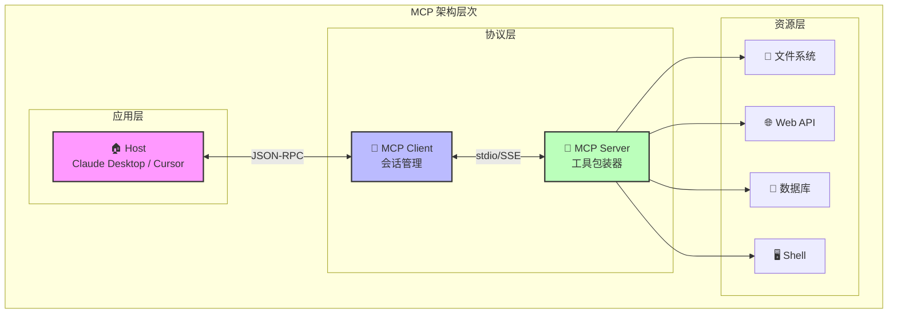
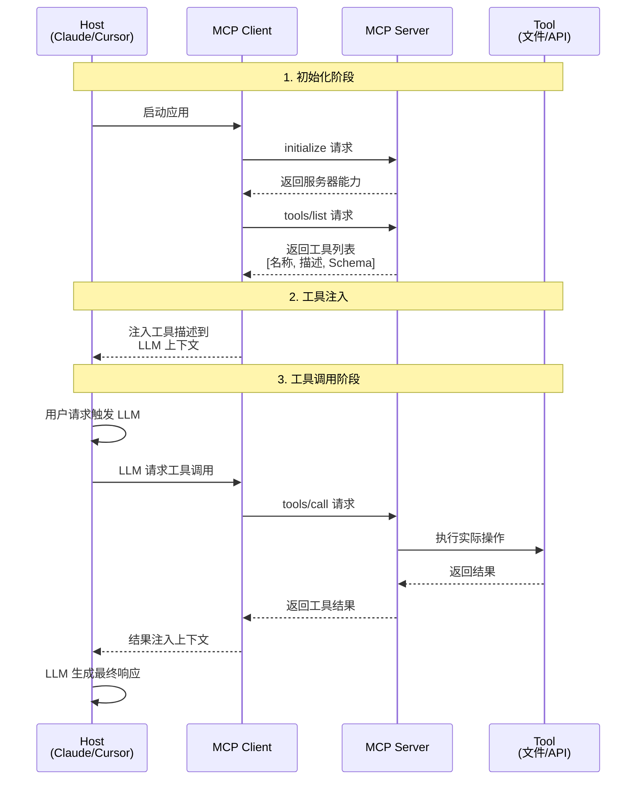
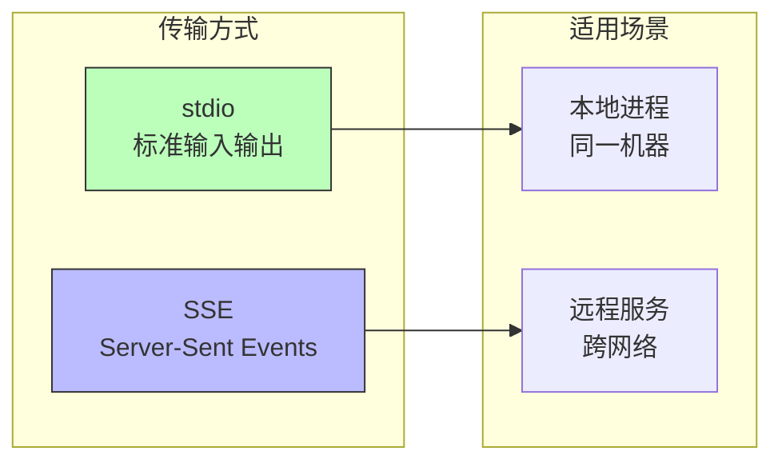
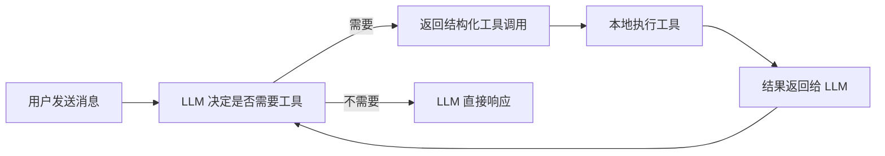

# 第 2 章：编程智能体的架构

## 课程概述

Agent 是 AI 编程的核心能力。理解底层原理才能更好使用工具。

### 学习目标
- 理解 Agent 架构的核心组件
- 掌握工具使用和函数调用机制
- 学习 MCP (Model Context Protocol) 协议
- 从零构建一个简单的 Coding Agent

---

## 1. 什么是 Coding Agent？

```
Agent = LLM + 工具 + 循环
```

- **LLM** 负责推理和决策
- **工具** 让 Agent 与世界交互
- **循环** 让 Agent 持续工作直到完成任务

### Agent 架构核心步骤

```
1. 读取用户输入 → 追加到对话
2. 告诉 LLM 可用工具（Read_file, List_dir, Edit_file, Create_file）
3. LLM 在适当时候请求使用工具
4. 本地执行工具并返回结果
5. 对话继续直到任务完成
```

---

## 2. Agent 架构详解

### 2.1 整体架构

Agent 的核心是一个 **感知-思考-行动** 的循环系统，也被称为 **ReAct (Reasoning + Acting)** 模式。



### 2.2 核心组件说明

| 组件 | 职责 | 关键特性 |
|------|------|----------|
| **输入处理器** | 解析用户请求，提取意图 | 支持多种输入格式 |
| **上下文管理器** | 管理对话历史和状态 | 上下文窗口优化 |
| **LLM 推理引擎** | 核心决策和推理 | 支持多种模型 |
| **工具选择器** | 根据意图选择合适工具 | 动态工具发现 |
| **工具集** | 执行具体操作 | 可扩展架构 |
| **响应生成** | 生成最终回复 | 多格式输出 |

---

## 3. Agent Loop 详解

### 3.1 Agent Loop 工作流程

Agent Loop 是 Agent 的核心执行机制，它决定了 Agent 如何迭代地处理任务。



### 3.2 Agent Loop 伪代码实现

```python
def agent_loop(user_input: str, tools: list[Tool], max_iterations: int = 10):
    """
    Agent 主循环实现
    """
    # 1. 初始化上下文
    messages = [
        {"role": "system", "content": SYSTEM_PROMPT},
        {"role": "user", "content": user_input}
    ]

    # 2. 开始循环
    for iteration in range(max_iterations):
        # 3. 调用 LLM
        response = llm.chat(
            messages=messages,
            tools=tools,  # 告诉 LLM 可用的工具
        )

        # 4. 检查是否需要工具调用
        if response.tool_calls:
            # 5. 执行所有工具调用
            for tool_call in response.tool_calls:
                # 执行工具
                result = execute_tool(tool_call.name, tool_call.args)

                # 将结果追加到消息历史
                messages.append({
                    "role": "tool",
                    "tool_call_id": tool_call.id,
                    "content": result
                })

            # 继续循环，让 LLM 处理工具结果
            continue

        # 6. 如果没有工具调用，检查是否完成
        if is_task_complete(response):
            return response.content

        # 7. 否则继续对话
        messages.append({"role": "assistant", "content": response.content})

    return "达到最大迭代次数，任务未完成"
```

### 3.3 关键循环参数

| 参数 | 说明 | 推荐值 |
|------|------|--------|
| `max_iterations` | 最大迭代次数，防止无限循环 | 10-50 |
| `timeout` | 单次 LLM 调用超时时间 | 30-120s |
| `context_window` | 上下文窗口大小 | 根据模型决定 |
| `retry_count` | 错误重试次数 | 3 |

---

## 4. 工具调用机制详解

### 4.1 工具调用流程



### 4.2 工具定义格式

工具使用 JSON Schema 定义，包含名称、描述和参数规范：

```json
{
  "name": "read_file",
  "description": "读取指定路径的文件内容",
  "parameters": {
    "type": "object",
    "properties": {
      "file_path": {
        "type": "string",
        "description": "文件的绝对路径"
      },
      "offset": {
        "type": "integer",
        "description": "起始行号，可选"
      },
      "limit": {
        "type": "integer",
        "description": "读取行数，可选"
      }
    },
    "required": ["file_path"]
  }
}
```

### 4.3 工具调用示例

```json
// LLM 请求调用工具
{
  "tool_calls": [
    {
      "id": "call_abc123",
      "type": "function",
      "function": {
        "name": "read_file",
        "arguments": "{\"file_path\": \"/src/main.py\"}"
      }
    }
  ]
}

// 工具执行结果返回给 LLM
{
  "role": "tool",
  "tool_call_id": "call_abc123",
  "content": "def main():\n    print('Hello, World!')\n"
}
```

### 4.4 多工具协作流程



---

## 5. 消息类型与上下文管理

### 5.1 消息类型



### 5.2 上下文窗口管理策略

| 策略 | 说明 | 适用场景 |
|------|------|----------|
| **滑动窗口** | 保留最近 N 条消息 | 简单对话 |
| **摘要压缩** | 压缩历史消息为摘要 | 长对话 |
| **语义检索** | 检索相关历史消息 | 复杂任务 |
| **优先级队列** | 按重要性保留消息 | 多任务场景 |

---

## 6. Terminology 术语

| 术语 | 描述 |
|------|------|
| **System Prompt** | 定义 LLM 整体行为和一些指令 |
| **User Prompt** | 用户的自定义请求 |
| **Assistant Prompt** | LLM 的响应 |
| **Tool Call** | LLM 发起的工具调用请求 |
| **Tool Result** | 工具执行后返回的结果 |
| **Context Window** | LLM 可处理的最大 token 数 |
| **Agent Loop** | Agent 的迭代执行循环 |

### Claude 的秘诀

1. **Front-load context** - 用小而精准的提示预先加载上下文
2. **System-reminder 标签** - 处处使用 <system-reminder> 防止行为漂移
3. **命令前缀提取** - 清晰提取用户命令
4. **子代理（Subagents）** - 生成子代理帮助防止上下文过载

---

## 7. 工具使用与 Function Calling

### Function Calling 原理

```json
{
  "name": "get_weather",
  "description": "获取指定城市的天气信息",
  "parameters": {
    "type": "object",
    "properties": {
      "city": { "type": "string", "description": "城市名称" }
    },
    "required": ["city"]
  }
}
```

### 常用工具
- **Read_file** - 读取文件内容
- **List_dir** - 列出目录内容
- **Edit_file** - 编辑文件
- **Create_file** - 创建新文件

### 工作流程

1. 定义工具的名称、描述和参数模式
2. LLM 根据用户请求决定何时调用工具
3. 执行工具并返回结果给 LLM
4. LLM 继续生成响应或请求更多工具

---

## 8. MCP (Model Context Protocol)

### 8.1 为什么需要 MCP？

- LLM 拥有大量但静态的世界知识，只有在重新训练时才会更新
- 构建完全自主的系统需要稳健的方式来输入动态数据

**动态数据示例**:
- 今天的天气怎么样？
- 谁是总统？
- 比特币价格是多少？
- Nike 最新广告的旁白是谁？

RAG 和工具调用是当前最好的解决方案。

### 8.2 MCP 定义

> Model Context Protocol：一个允许系统以通用方式向 AI 模型提供上下文的协议

### 8.3 MCP 整体架构



### 8.4 MCP 通信流程详解



### 8.5 MCP 优势

| 优势 | 描述 |
|------|------|
| **标准化** | 统一的工具描述格式，使用 JSON-RPC |
| **可扩展** | MCP Server 可以包装任何工具 |
| **减少集成工作** | M x N → M + N |
| **继承自 LSP** | 扩展自 Language Server Protocols |
| **支持主动工作流** | 不只是被动响应，而是主动代理工作流 |

### 8.6 MCP 核心组件

| 组件 | 描述 |
|------|------|
| **Host** | Cursor, Claude Desktop 等 AI IDE |
| **MCP Client** | 嵌入在 Host 中的库（每个服务器有状态会话） |
| **MCP Server** | 工具前端的轻量级包装器 |
| **Tool** | 可调用的函数（可以是数据源、API） |

### 8.7 MCP 工具定义示例

```json
{
  "name": "read_file",
  "description": "读取本地文件的内容",
  "inputSchema": {
    "type": "object",
    "properties": {
      "path": {
        "type": "string",
        "description": "要读取的文件路径"
      }
    },
    "required": ["path"]
  }
}
```

### 8.8 MCP 传输层



### 8.9 MCP 局限性

- **工具处理能力有限**: Agent 对大量工具处理不佳
- **上下文窗口消耗**: API 快速消耗上下文窗口
- **AI 原生设计**: 设计 API 时要考虑 AI 的使用方式

---

## 9. 从零构建 Coding Agent：200 行代码的秘密

> 本节内容基于 Mihail Eric 的文章 ["The Emperor Has No Clothes: How to Code Claude Code in 200 Lines of Code"](https://www.mihaileric.com/The-Emperor-Has-No-Clothes/)

### 9.1 核心洞察

今天的 AI 编程助手看起来像魔法。你用支离破碎的英语描述需求，它们就能读取文件、编辑项目、编写功能代码。

但真相是：**这些工具的核心不是魔法，而是约 200 行简单的 Python 代码。**

### 9.2 心智模型

理解 Coding Agent 的关键在于认识到它本质上只是一个**拥有工具箱的 LLM 对话**：



**关键点**: LLM 从不直接触碰你的文件系统。它只是请求操作发生，你的代码使其发生。

### 9.3 三个核心工具

一个最小化的 Coding Agent 只需要三个工具：

| 工具 | 功能 | 必要性 |
|------|------|--------|
| **read_file** | 读取文件内容 | 让 LLM 看到你的代码 |
| **list_files** | 列出目录内容 | 让 LLM 导航项目结构 |
| **edit_file** | 编辑/创建文件 | 让 LLM 修改代码 |

生产环境的 Agent（如 Claude Code）有更多工具（grep、bash、websearch 等），但三个工具足以完成惊人的工作。

### 9.4 代码实现

#### 基础设置

```python
import inspect
import json
import os
import anthropic
from dotenv import load_dotenv
from pathlib import Path
from typing import Any, Dict, List, Tuple

load_dotenv()
claude_client = anthropic.Anthropic(api_key=os.environ["ANTHROPIC_API_KEY"])

# 终端颜色输出
YOU_COLOR = "\u001b[94m"
ASSISTANT_COLOR = "\u001b[93m"
RESET_COLOR = "\u001b[0m"

def resolve_abs_path(path_str: str) -> Path:
    """将相对路径转换为绝对路径"""
    path = Path(path_str).expanduser()
    if not path.is_absolute():
        path = (Path.cwd() / path).resolve()
    return path
```

#### 工具 1：读取文件

```python
def read_file_tool(filename: str) -> Dict[str, Any]:
    """
    Gets the full content of a file provided by the user.
    :param filename: The name of the file to read.
    :return: The full content of the file.
    """
    full_path = resolve_abs_path(filename)
    with open(str(full_path), "r") as f:
        content = f.read()
    return {
        "file_path": str(full_path),
        "content": content
    }
```

#### 工具 2：列出文件

```python
def list_files_tool(path: str) -> Dict[str, Any]:
    """
    Lists the files in a directory provided by the user.
    :param path: The path to a directory to list files from.
    :return: A list of files in the directory.
    """
    full_path = resolve_abs_path(path)
    all_files = []
    for item in full_path.iterdir():
        all_files.append({
            "filename": item.name,
            "type": "file" if item.is_file() else "dir"
        })
    return {
        "path": str(full_path),
        "files": all_files
    }
```

#### 工具 3：编辑文件

```python
def edit_file_tool(path: str, old_str: str, new_str: str) -> Dict[str, Any]:
    """
    Replaces first occurrence of old_str with new_str in file.
    If old_str is empty, create/overwrite file with new_str.
    """
    full_path = resolve_abs_path(path)
    if old_str == "":
        full_path.write_text(new_str, encoding="utf-8")
        return {"path": str(full_path), "action": "created_file"}

    original = full_path.read_text(encoding="utf-8")
    if original.find(old_str) == -1:
        return {"path": str(full_path), "action": "old_str not found"}

    edited = original.replace(old_str, new_str, 1)
    full_path.write_text(edited, encoding="utf-8")
    return {"path": str(full_path), "action": "edited"}
```

#### 工具注册表

```python
TOOL_REGISTRY = {
    "read_file": read_file_tool,
    "list_files": list_files_tool,
    "edit_file": edit_file_tool
}
```

#### 系统提示词

```python
SYSTEM_PROMPT = """
You are a coding assistant whose goal it is to help us solve coding tasks.
You have access to a series of tools you can execute. Here are the tools you can execute:
{tool_list_repr}
When you want to use a tool, reply with exactly one line in the format:
'tool: TOOL_NAME({{JSON_ARGS}})' and nothing else.
Use compact single-line JSON with double quotes. After receiving a tool_result(...)
message, continue the task.
If no tool is needed, respond normally.
"""
```

#### 解析工具调用

```python
def extract_tool_invocations(text: str) -> List[Tuple[str, Dict[str, Any]]]:
    """
    从 'tool: name({...})' 格式的行中提取工具调用
    """
    invocations = []
    for raw_line in text.splitlines():
        line = raw_line.strip()
        if not line.startswith("tool:"):
            continue
        try:
            after = line[len("tool:"):].strip()
            name, rest = after.split("(", 1)
            name = name.strip()
            if not rest.endswith(")"):
                continue
            json_str = rest[:-1].strip()
            args = json.loads(json_str)
            invocations.append((name, args))
        except Exception:
            continue
    return invocations
```

#### Agent 循环

```python
def run_coding_agent_loop():
    conversation = [{
        "role": "system",
        "content": get_full_system_prompt()
    }]

    while True:
        # 获取用户输入
        user_input = input(f"{YOU_COLOR}You:{RESET_COLOR}:")
        conversation.append({
            "role": "user",
            "content": user_input.strip()
        })

        # 内循环：处理工具调用
        while True:
            assistant_response = execute_llm_call(conversation)
            tool_invocations = extract_tool_invocations(assistant_response)

            if not tool_invocations:
                # 无工具调用，输出响应
                print(f"{ASSISTANT_COLOR}Assistant:{RESET_COLOR}: {assistant_response}")
                conversation.append({
                    "role": "assistant",
                    "content": assistant_response
                })
                break

            # 执行所有工具调用
            for name, args in tool_invocations:
                tool = TOOL_REGISTRY[name]
                result = tool(**args)
                conversation.append({
                    "role": "user",
                    "content": f"tool_result({json.dumps(result)})"
                })
```

### 9.5 运行示例

```
You: 创建一个 hello.py 文件，实现 hello world

Agent 调用: edit_file(path="hello.py", old_str="", new_str="print('Hello World')")

Assistant: 完成！已创建 hello.py 并实现 hello world。

You: 编辑 hello.py，添加一个两数相乘的函数

Agent 调用: read_file(filename="hello.py")  # 查看当前内容
Agent 调用: edit_file(path="hello.py", old_str="...", new_str="...")

Assistant: 已在 hello.py 中添加 multiply 函数。
```

### 9.6 与生产工具的对比

| 特性 | 我们的实现 | Claude Code 等生产工具 |
|------|-----------|----------------------|
| 核心循环 | ✓ 相同 | ✓ 相同 |
| 错误处理 | 基础 | 完善 |
| 响应流式输出 | ✗ | ✓ |
| 上下文管理 | 基础 | 智能（摘要长文件等） |
| 工具数量 | 3 个 | 更多（bash、grep、websearch 等） |
| 审批工作流 | ✗ | ✓（破坏性操作需确认） |
| 代码行数 | ~200 行 | 数千行 |

**核心结论**: 生产工具增加了许多工程细节，但核心架构就是我们实现的这个循环——LLM 决定做什么，代码执行它，结果流回来。这就是整个架构。

### 9.7 关键学习点

1. **工具描述很重要**: 函数的 docstring 会直接用于告诉 LLM 如何使用工具
2. **结构化返回**: 工具返回字典，LLM 需要结构化的上下文
3. **约定优于配置**: 如 `old_str=""` 表示创建新文件
4. **循环即一切**: 外循环获取用户输入，内循环处理工具调用链

---

## 10. 实践练习

### 练习 1: 理解 Agent 循环
在 Claude 或 Cursor 中观察 Agent 如何：
1. 接收用户请求
2. 决定使用哪些工具
3. 执行工具并处理结果
4. 继续直到任务完成

### 练习 2: 探索 MCP
1. 在 Cursor 或 Claude Desktop 中查看可用的 MCP
2. 尝试添加一个新的 MCP Server
3. 观察工具如何被描述给 LLM

### 练习 3: 构建简单 Agent
尝试从零构建一个简单的 Coding Agent：
1. 设置 LLM API
2. 定义可用工具
3. 实现 agent 循环
4. 测试基本功能

### 练习 4: 扩展 Agent 功能
基于第 9 节的代码，尝试添加以下功能：
1. 添加 `grep_search` 工具搜索代码内容
2. 添加 `run_bash` 工具执行命令
3. 实现流式输出
4. 添加操作确认机制

---

## 讲座资料

### Lecture 3: Building a coding agent from scratch
- [Slides (PDF)](../slides/week2-lecture1-coding-agent-scratch.pdf)

### Lecture 4: Building a custom MCP server
- [Slides (PDF)](../slides/week2-lecture2-mcp-server.pdf)

---

## 阅读材料

1. **[The Emperor Has No Clothes: How to Code Claude Code in 200 Lines of Code](https://www.mihaileric.com/The-Emperor-Has-No-Clothes/)** - Mihail Eric
2. **[MCP Introduction](https://stytch.com/blog/model-context-protocol-introduction/)**
3. **[Sample MCP Server Implementations](https://github.com/modelcontextprotocol/servers)**

---

## 作业

**[Chapter 2 Assignment](https://github.com/mihail911/modern-software-dev-assignments/tree/master/week2)**

在 AI IDE 中完成开发任务。

---

## 下一章

[下一章：Chapter 3](./chapter3.md)

---
