# 第 3 章：AI 集成开发环境

## 课程概述

AI IDE 本质是增强而非替代。上下文质量决定输出质量。

### 学习目标
- 理解 AI IDE 的工作原理
- 掌握 AI IDE 的最佳实践
- 学习同步与异步工具的使用场景
- 理解 2025 年的编程工作流

---

## 1. 为什么是 IDE？

### 1.1 IDE 的定义

**IDE (Integrated Development Environment)** 是软件开发的一体化工作空间，包含：
- 代码编辑器
- 编译器
- 调试器
- 更多开发工具

### 1.2 为什么 AI 增强 IDE 是自然的演进


### 1.3 IDE 演进的核心张力

IDE 的演进始终存在一种张力：

| 方向 | 描述 |
|------|------|
| **功能整合** | 将更多功能集成到一个工具中 |
| **开发者定制** | 允许开发者自由选择和配置工具 |

---

## 2. AI IDE 发展历史

### 2.1 时间线

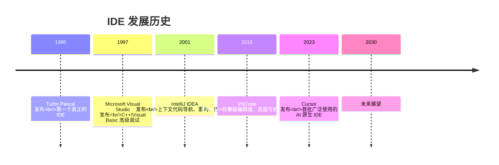

### 2.2 关键里程碑

| 年份 | 产品 | 核心创新 |
|------|------|----------|
| 1980 | Turbo Pascal | 第一个真正的 IDE，集成编辑、编译、调试 |
| 1997 | Visual Studio | C++/Visual Basic 的高级调试能力 |
| 2001 | IntelliJ IDEA | 上下文代码导航、重构、智能补全 |
| 2015 | VSCode | 轻量级 + 高度可扩展的生态系统 |
| 2023 | Cursor | 首批广泛使用的 AI 原生 IDE |

---

## 3. AI IDE 两种模式

### 3.1 基础模式 (Bread-and-butter Modes)

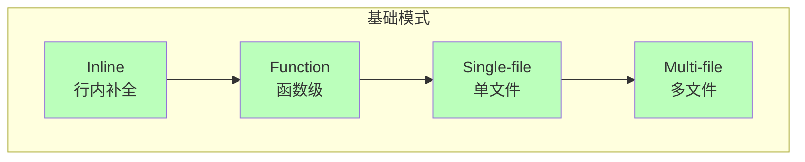

| 模式 | 描述 | 典型场景 |
|------|------|----------|
| **Inline** | 行内代码补全 | 快速完成单行代码 |
| **Function** | 函数级别生成 | 生成整个函数实现 |
| **Single-file** | 单文件操作 | 重构单个文件 |
| **Multi-file** | 多文件操作 | 跨文件的重构和修改 |

### 3.2 原生 AI 模式 (True AI-native)

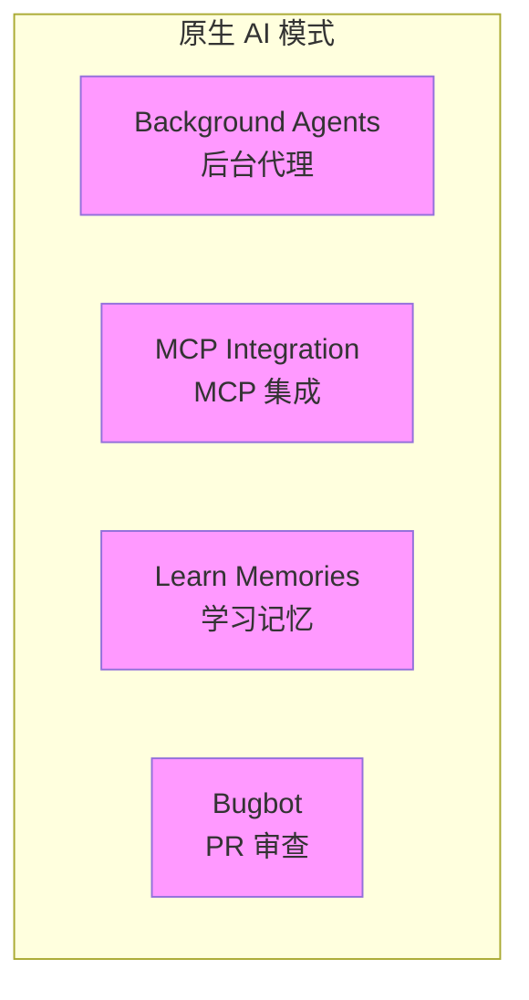

| 功能 | 描述 |
|------|------|
| **Background Agents** | 后台运行的 AI 代理，可并行处理多个任务 |
| **MCP Integration** | 集成 MCP 协议，扩展工具能力 |
| **Learn Memories** | AI 学习和记忆项目特定的上下文 |
| **Bugbot** | 自动 PR 审查，发现潜在问题 |

---

## 4. AI IDE 工作原理

### 4.1 Tab Complete（代码补全）

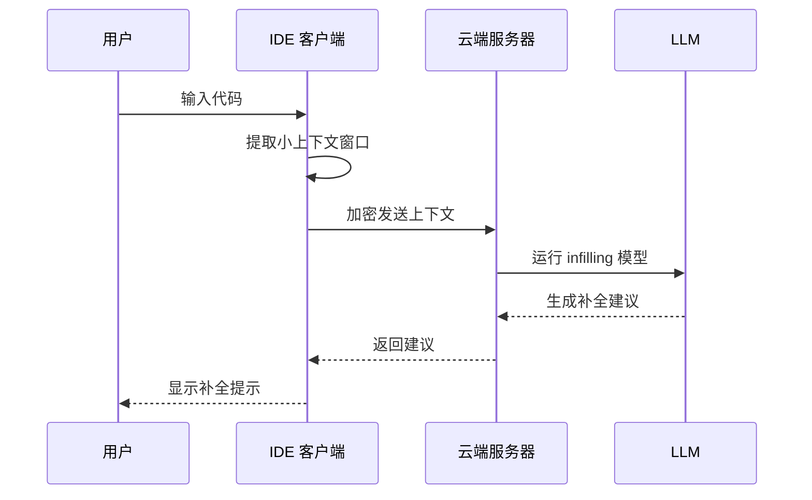

**工作流程：**
1. 当前代码周围的小上下文窗口被加密
2. 服务器接收并运行 infilling LLM
3. 建议返回并显示给用户

### 4.2 Chat（对话模式）

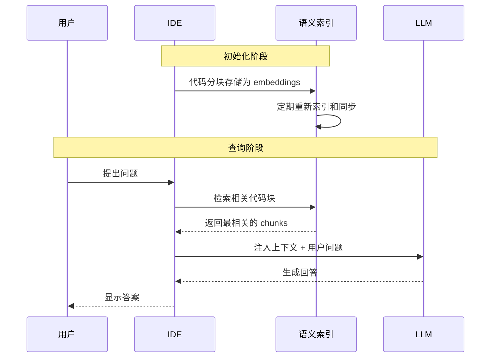

**关键技术：**

| 技术 | 描述 |
|------|------|
| **代码分块** | 将代码拆分为语义单元存储 |
| **Embeddings** | 代码块的向量表示，支持语义搜索 |
| **语义索引** | 支持模糊搜索的索引结构 |
| **Merkle Trees** | 用于高效计算代码差异，优化同步 |
| **文件名混淆** | 保护隐私，不暴露真实文件名 |

### 4.3 Context Management（上下文管理）

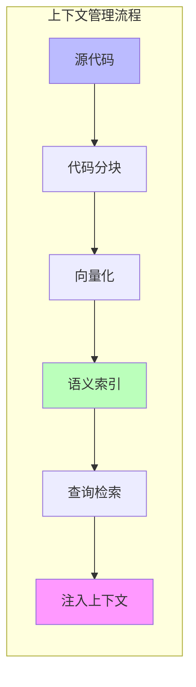

---

## 5. 同步 vs 异步工具

### 5.1 三个时代的 AI 编程工具

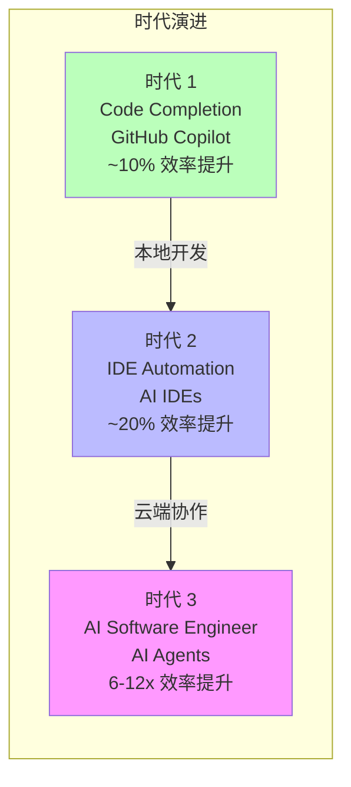

| 时代 | 工具类型 | 代表产品 | 效率提升 | 特点 |
|------|----------|----------|----------|------|
| 1 | Code Completion | GitHub Copilot | ~10% | 代码补全，本地开发 |
| 2 | IDE Automation | Cursor, Windsurf | ~20% | 单任务完成，本地同步 |
| 3 | AI Software Engineer | Devin | 6-12x | 多任务并行，云端异步 |

### 5.2 同步 (Synchronous) 模式


**特点：**
- **单线程**：一次只处理一个任务
- **人在循环中**：人类持续参与决策
- **注意力集中**：专注于一个任务
- **AI 工作时间**：20 秒 - 1.5 分钟
- **保持心流状态**

**本地工具**：Windsurf, Cursor

### 5.3 异步 (Asynchronous) 模式

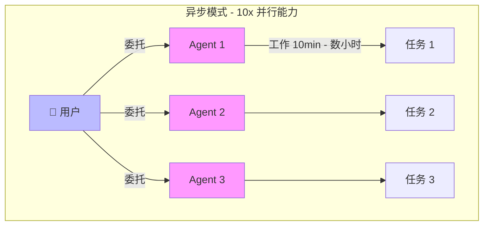

**特点：**
- **多线程**：同时处理多个任务
- **人类委托**：人类分配任务后切换注意力
- **注意力切换**：在多个任务间流转
- **AI 工作时间**：10 分钟 - 数小时
- **10x 并行能力**

**云端工具**：Devin, DeepWiki, Codemaps

### 5.4 本地 vs 云端对比

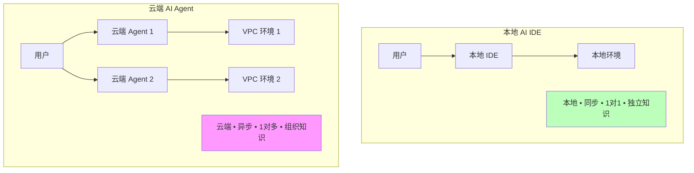

| 维度 | 本地 AI IDE | 云端 AI Agent |
|------|-------------|---------------|
| 位置 | 本地 | 云端 VPC |
| 模式 | 同步 | 异步 |
| 关系 | 1 对 1 | 1 对多 |
| 知识 | 独立/隔离 | 组织级共享 |
| 用途 | 提升个人速度 | 无限并行能力 |

### 5.5 半异步陷阱

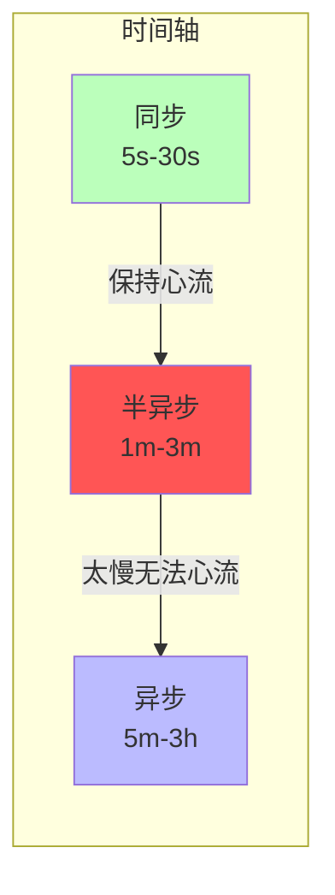

**半异步的问题：**
- **太慢**：无法保持心流状态
- **太短**：无法进行多任务切换
- **建议**：避免！要么加快到同步，要么扩展到异步

### 5.6 使用异步代理的挑战

> "Managing async agents can unlock 10x gains… but most people use sync agents."

**为什么大多数人使用同步工具？**

1. **管理是难技能** - 无论对人还是对 Agent
2. **需要多任务切换** - 在不同上下文间快速切换
3. **需要快速理解新上下文** - 快速掌握新任务背景

---

## 6. 2025 编程工作流

### 6.1 工作流程概览

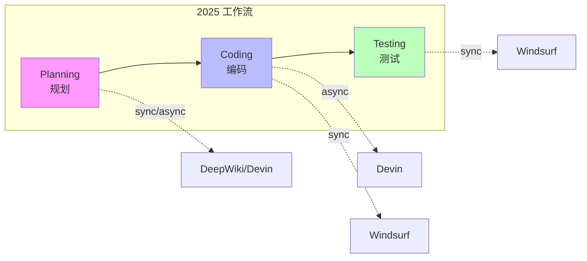

### 6.2 规划阶段 (Planning)

**推荐工具：**
- DeepWiki - 代码库理解和文档
- Ask Devin - 获取 AI 规划建议
- Codemaps - 代码结构映射
- DeepWiki in Windsurf - 本地代码理解

### 6.3 编码阶段 (Coding)

**异步委托：**
```
1. 将任务委托给 Devin (async)
2. AI Agent 独立完成编码工作
3. 人类可以处理其他任务
```

### 6.4 测试阶段 (Testing)

**常见工作流：**
```
1. 委托任务给 Devin (async)
2. 在 Windsurf 中测试和迭代修改 (sync)
```

**未来展望：**
> 如果异步代理能够自主测试，杠杆效应将进一步增加。这正在慢慢成为现实。

### 6.5 未来演进

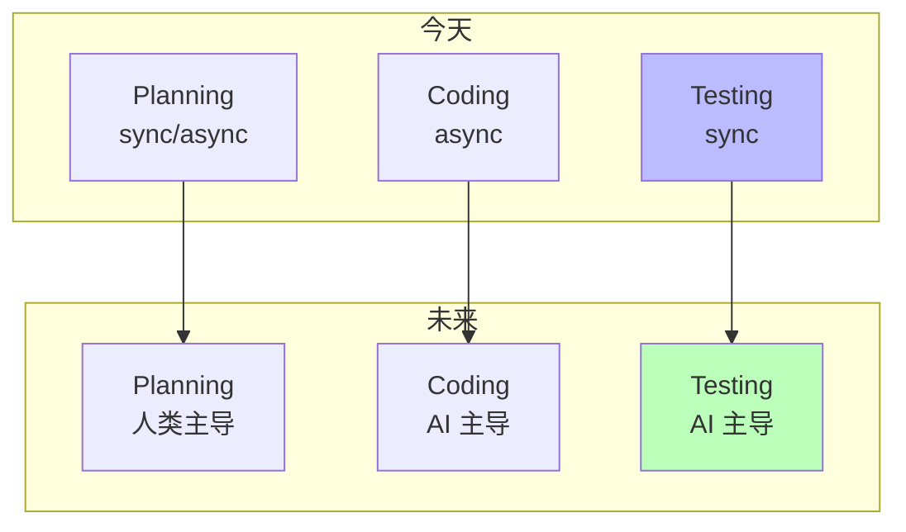

---

## 7. 最佳实践

### 7.1 编写有效的任务描述

对于简单修改，不需要过于详细的提示。但对于复杂任务，你需要成为一名**产品经理**，编写详细的规格文档。

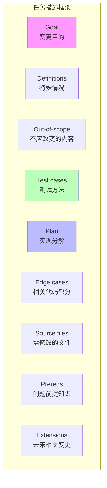

| 要素 | 问题 | 描述 |
|------|------|------|
| **Goal** | 变更的目的是什么？ | 清晰的目标陈述 |
| **Definitions** | 什么特殊情况需要考虑？ | 边界条件和定义 |
| **Out-of-scope** | 什么*不应该*被改变？ | 明确的范围限制 |
| **Test cases** | 如何进行测试？ | 测试策略和方法 |
| **Plan** | 高级实现分解 | 实现步骤概述 |
| **Edge cases** | 代码库的相关部分及原因 | 需要注意的边界情况 |
| **Source files** | 需要更改的源文件 | 具体文件列表 |
| **Prereqs** | LLM 需要知道的问题前提 | 背景知识说明 |
| **Extensions** | 以后可能相关的更改 | 未来设计考虑 |

### 7.2 优化代码库

> "Optimize your codebase so that a human and an agent could understand what's going on"

**LLM 困惑的主要来源**：尝试用混乱的 repo 作为上下文完成任务。

**优化维度：**

| 维度 | 内容 |
|------|------|
| **描述性** | Repo 方向、文件结构 |
| **可运行性** | 设置和环境配置 |
| **一致性** | 最佳实践、代码风格 |
| **可访问性** | 访问模式、API 和契约 |

**提示**：仓库中使用 monorepo 设计是高度推荐的。

### 7.3 导航文件配置

帮助 LLM 导航你的代码库的配置文件：

| 文件 | 用途 | 示例内容 |
|------|------|----------|
| **CLAUDE.md** | Claude 自动加载的上下文文件 | 常用命令、核心文件、代码风格、测试说明 |
| **cursorrules** | Cursor 的规则配置 | 项目特定规则和偏好 |
| **AGENTS.md** | 开放格式的 Agent 指令 | 通用 Agent 指导说明 |
| **llms.txt** | 为 LLM 抓取网页提供导航指导 | Web 可访问的项目文档 |

**CLAUDE.md 示例：**

```markdown
# Project Overview
Brief description of the project

## Common Commands
- `npm run dev`: Start development server
- `npm test`: Run tests
- `npm run build`: Build for production

## Core Files
- `src/index.ts`: Entry point
- `src/api/`: API handlers
- `src/utils/`: Utility functions

## Code Style
- Use TypeScript
- Follow ESLint rules
- Write tests for new features

## Testing
- Run `npm test` before committing
- Add tests for bug fixes
```

**注意**：Agent 并不总是遵守这些描述/指令，它们仅供参考。

---

## 8. 未来展望

### 8.1 人类工程师的新角色

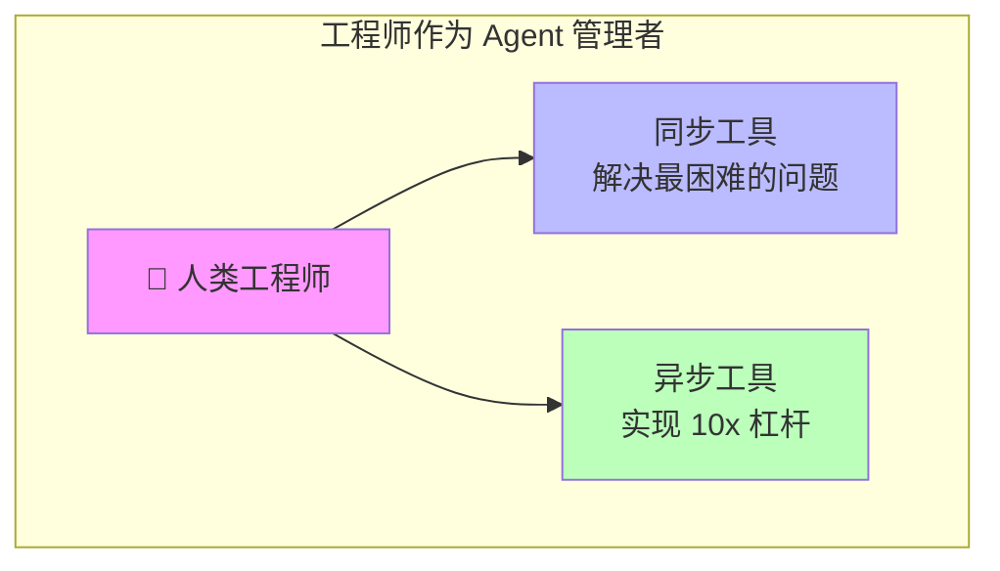

**人类工程师将成为 Agent 管理者：**
1. 利用同步工具解决最困难的问题
2. 利用异步工具实现 10x 杠杆效应

### 8.2 未来必备技能

| 技能 | 描述 |
|------|------|
| **委托与多线程** | 有效分配任务给多个 Agent |
| **代码阅读** | 快速理解和审核 AI 生成的代码 |
| **规划、范围界定、架构** | 高层次的设计和决策能力 |

---

## 9. 实践练习

### 练习 1: 配置 CLAUDE.md
创建一个 CLAUDE.md 文件，包含：
- 项目简介
- 常用命令
- 代码风格指南
- 测试说明

### 练习 2: 尝试同步/异步工具
1. 使用 Windsurf 进行同步编码
2. 使用 Devin 进行异步任务
3. 比较两者的使用体验
4. 练习在多个异步任务间切换

### 练习 3: 探索 AI IDE 功能
1. 尝试 Tab Complete
2. 尝试 Chat 模式
3. 探索 MCP 集成
4. 测试 Background Agents

### 练习 4: 编写任务描述
为一个中等复杂度的任务编写详细的任务描述，包含所有 9 个要素。

---

## 讲座资料

### Lecture 5: The AI IDE: Fundamentals to Power User
- [Slides (PDF)](../slides/week3-lecture1-ide-setup.pdf)
- **Guest Speaker**: Silas Alberti, Cognition（Head of Research）
- **日期**: 10/10/25, 8:30am PT, 420-041

### Lecture 6: IDE ❤ Agents - An opinionated guide to AI coding in 2025
- [Slides (PDF)](../slides/week3-lecture2-cognition.pdf)
- **Guest Speaker**: Silas Alberti, Founding Team @ Cognition
- **核心内容**: 同步 vs 异步工具，2025 编程工作流，未来技能

---

## 阅读材料

1. **[Claude Code 文档](https://docs.anthropic.com/en/docs/claude-code)**
2. **[Cursor 文档](https://cursor.sh/docs)**
3. **[Devin 文档](https://docs.devin.ai)**

---

## 作业

**[Chapter 3 Assignment](https://github.com/mihail911/modern-software-dev-assignments/tree/master/week3)**

熟悉 AI IDE 环境，掌握最佳实践。

---

## 下一章

[下一章：Chapter 4](./chapter4.md)

---