# 第 4 章：编程智能体模式

## 课程概述

开发者正从"做"变为"管理"。Subagents 是未来趋势：agents 管理 agents。

### 学习目标
- 理解 Agent 管理的设计模式
- 掌握 Claude Code 的使用技巧
- 学习 Hooks、Commands、Subagents 的使用
- 了解 Anthropic 内部实践经验

---

## 1. 开发演进趋势

### 1.1 开发角色的演变

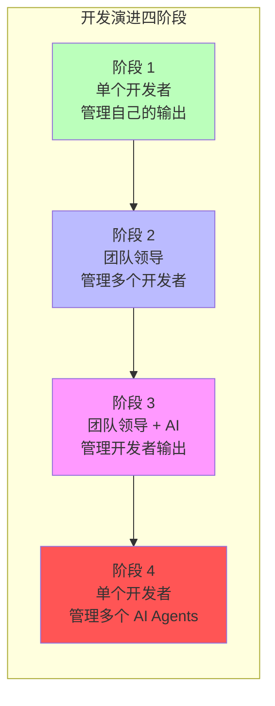

| 阶段 | 角色 | 描述 |
|------|------|------|
| 1 | 独立开发者 | 单个开发者管理单个开发者的输出 |
| 2 | 团队领导 | 领导者管理多个开发者的输出 |
| 3 | AI 辅助团队 | 领导者管理多个开发者的输出（AI 系统辅助） |
| 4 | Agent 管理者 | 单个开发者管理多个 AI agents 的工作 |

### 1.2 软件团队历史

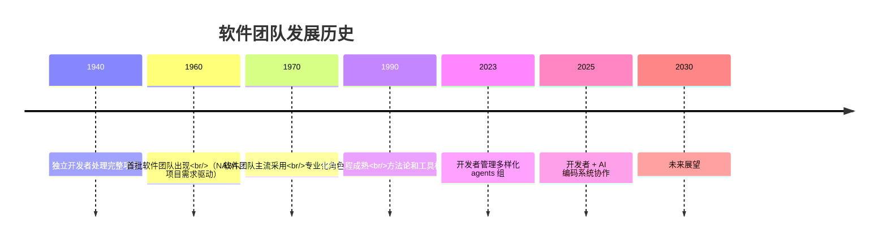

| 年份 | 里程碑 | 标志性变化 |
|------|--------|------------|
| 1940 | 独立开发者 | 单人处理完整项目 |
| 1960 | 首批软件团队 | NASA、DoD 项目需求驱动 |
| 1970 | 主流采用 | 专业化角色出现 |
| 1990 | 工程成熟 | 方法论和工具标准化 |
| 2023 | Agent 组管理 | 开发者管理多样化 agents |
| 2025 | AI 协作 | 开发者 + AI 编码系统 |
| 2030 | 未来展望 | Agents 管理 agents |

---

## 2. 编程生产力的指数级增长

### 2.1 编程语言生产力演进

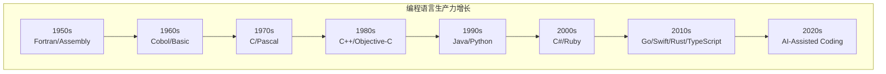

**关键洞察**：编程语言生产力正以指数级增长，由 AI 驱动。

### 2.2 IDE 生产力演进

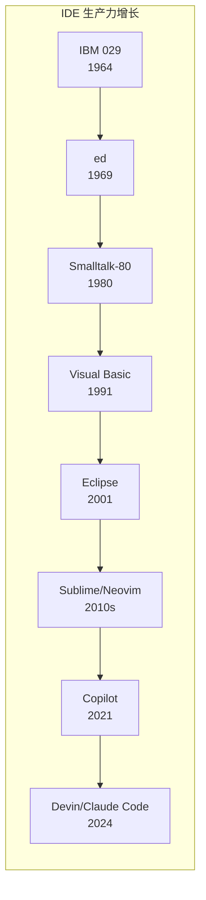

**关键洞察**：IDE 生产力也呈类似指数级增长，同样由 AI 驱动。

### 2.3 验证方法的演进

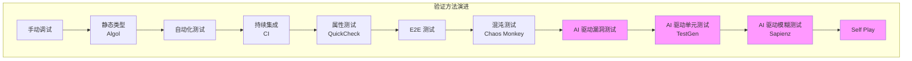

---

## 3. 软件任务步骤与职责分配

### 3.1 任务步骤概览

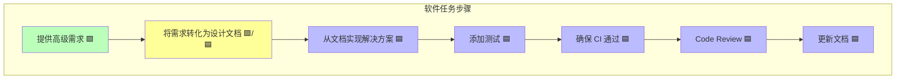

### 3.2 职责分配图例

| 颜色 | 含义 | 执行者 |
|------|------|--------|
| 🟩 绿色 | 人类主导 | 开发者 |
| 🟩/🟦 黄色 | 协作完成 | 开发者 + Agent |
| 🟦 蓝色 | Agent 主导 | AI Agent |

---

## 4. Agent 管理技巧

### 4.1 四种核心技术

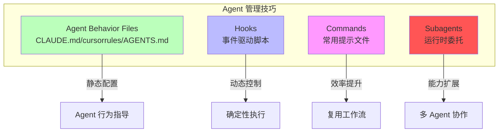

### 4.2 Hooks（钩子）

> **定义**：确定性脚本，在预定义事件类型上运行

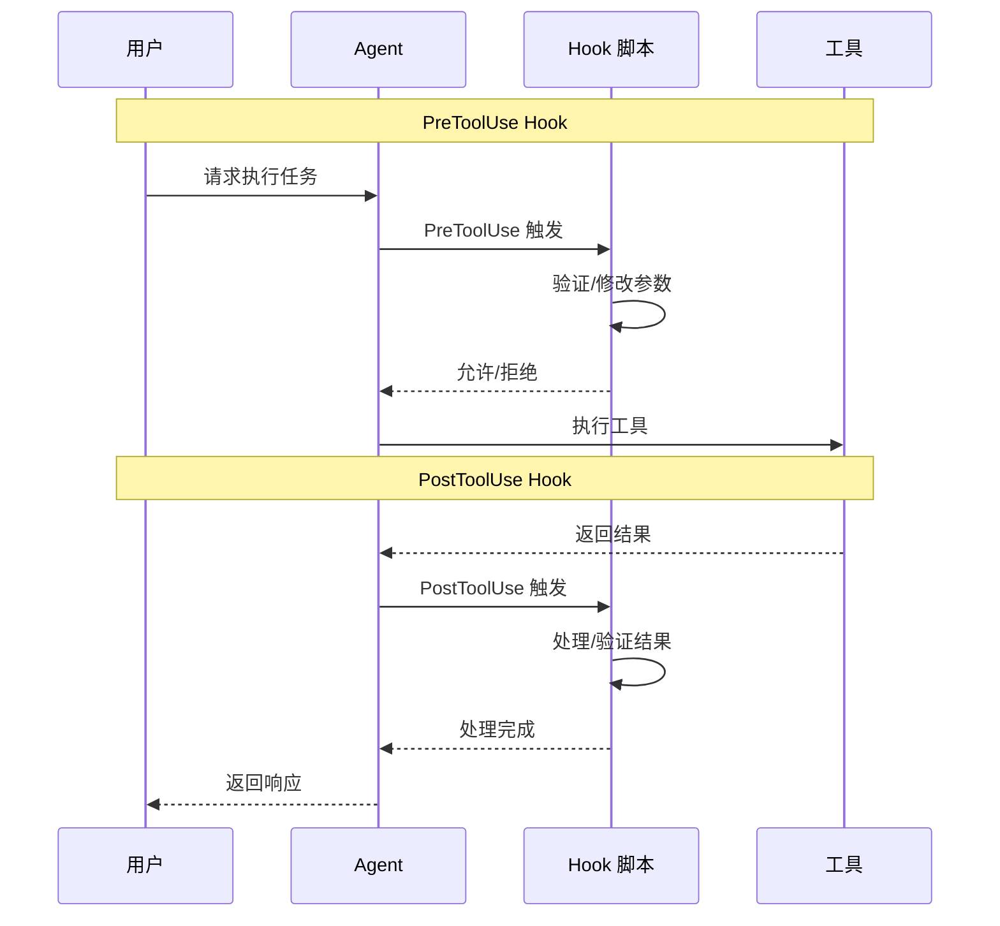

**Hook 类型：**

| Hook 类型 | 触发时机 | 典型用途 |
|-----------|----------|----------|
| `PreToolUse` | 工具使用前 | 验证参数、添加约束 |
| `PostToolUse` | 工具使用后 | 验证结果、日志记录 |
| `UserPromptSubmit` | 用户提交提示时 | 输入预处理 |
| `PreCompact` | 上下文压缩前 | 保留关键信息 |
| `...` | 更多类型 | 持续扩展 |

### 4.3 Commands（命令）

> **定义**：将常用提示保存为文件供 Agent 执行

**使用场景：**

| 场景 | 描述 |
|------|------|
| 运行测试 | 自动化测试流程 |
| 代码审查 | 标准化审查流程 |
| Git 操作 | 提交、推送标准化 |
| 部署流程 | 自动化部署步骤 |

**优势：**
- 复用高频工作流
- 团队标准化
- 减少重复输入

### 4.4 Subagents（子代理）

> **定义**：运行时委托，创建独立开发者角色

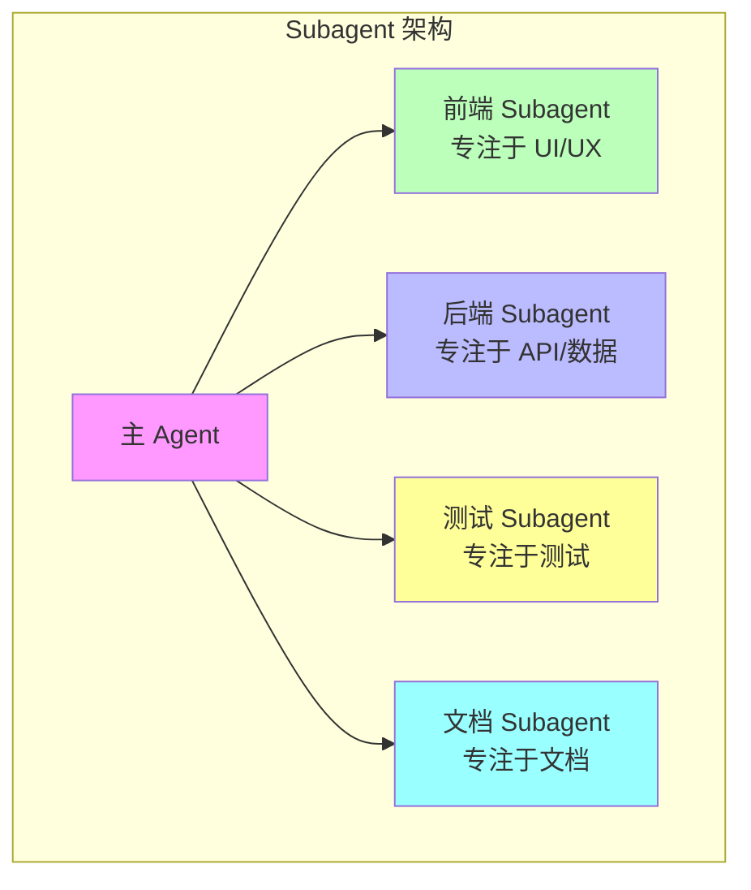

**Subagent 的目的：**

1. **创建不同开发者角色**
   - 前端专家
   - 后端专家
   - 测试专家
   - 文档专家

2. **清晰分离上下文**
   - 独立的工作流上下文
   - 避免上下文污染

3. **提供定制能力**
   - 自定义系统提示
   - 专用工具集
   - 独立上下文窗口

4. **走向 Agents 管理 Agents**
   - 层级化管理
   - 专业化分工

**参考资源：**
- [Awesome Claude Agents](https://github.com/vijaythecoder/awesome-claude-agents)
- [SuperClaude Framework](https://github.com/SuperClaude-Org/SuperClaude_Framework)

### 4.5 Agent Behavior Files

| 文件 | 工具 | 用途 |
|------|------|------|
| `CLAUDE.md` | Claude Code | Claude 自动加载的上下文 |
| `cursorrules` | Cursor | Cursor 规则配置 |
| `AGENTS.md` | 通用 | 开放格式的 Agent 指令 |

---

## 5. Claude Code 深度指南

### 5.1 Claude Code 的方法

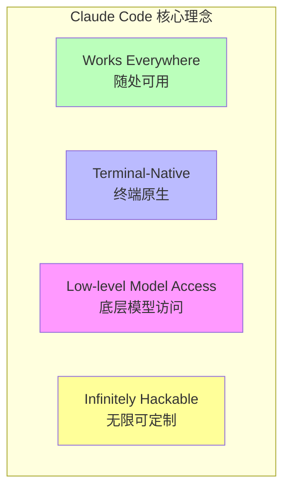

### 5.2 覆盖整个 SDLC

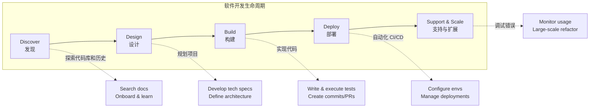

**使用团队的 CLI 工具**：git, docker, bq 等，让你专注于解决方案而非语法。

### 5.3 多种界面

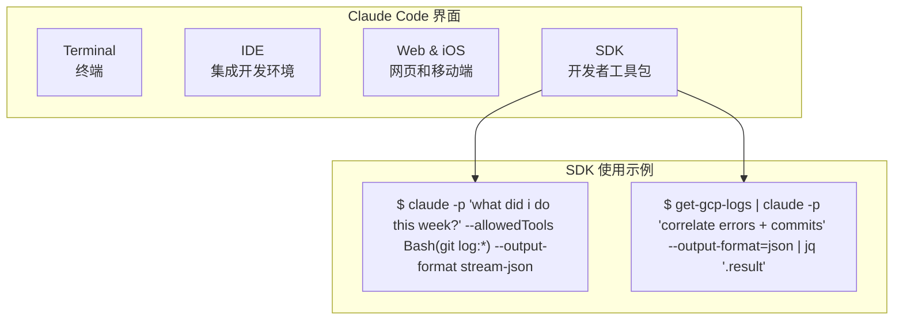

### 5.4 安装

```bash
npm install -g @anthropic-ai/claude-code
```

### 5.5 核心使用场景

#### 场景 1：Codebase Q&A + Research

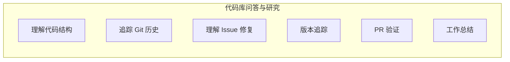

**示例问题：**
```
> how do I make a new @app/services/ValidationTemplateFactory?
> why does recoverFromException take so many arguments? look through git history to answer
> why did we fix issue #18363 by adding the if/else in @src/login.ts api?
> in which version did we release the new @api/ext/PreHooks.php api?
> look at PR #9383, then carefully verify which app versions were impacted
> what did I ship last week?
```

#### 场景 2：Write Code

| 模式 | 描述 |
|------|------|
| **1-shot** | 单次完成，适合简单任务 |
| **Sidekick** | 助手模式，人机协作 |
| **Prototype** | 快速原型，迭代优化 |

#### 场景 3：Integrate Tools & MCPs

```bash
# 添加 MCP Server
$ claude mcp add barley_server -- node myserver

# 使用 MCP
> use the barley mcp server to check for error logs
```

#### 场景 4：Power Automation

自动化复杂工作流程，减少重复性工作。

### 5.6 工作流适配任务

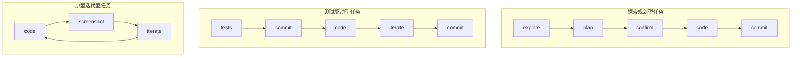

**工作流示例：**

**探索规划型：**
```
> figure out the root cause for issue #983, then propose a few fixes.
  Let me choose an approach before you code. ultrathink
```

**测试驱动型：**
```
> write tests for @utils/markdown.ts to make sure links render properly
  (note the tests won't pass yet, since links aren't yet implemented).
  then commit. then update the code to make the tests pass.
```

**原型迭代型：**
```
> implement [mock.png]. Then screenshot it with puppeteer and iterate
  till it looks like the mock.
```

### 5.7 原型迭代示例

展示 Claude Code 如何快速迭代 UI 设计：

```
> make it so instead of todos showing up as they come in, we hide the
  tool use and result for todos, and render a fixed todo list above
  the input. title it "/todo (1 of 3)" in grey

> actually don't show a todo list at all, and instead render the tool
  uses inline, as bold headings when the model starts working on a todo

> also add a todo pill under the text input, similar to bg tasks

> actually undo both the pill and headings. instead, make the todo list
  render to the right of the input, vertically centered with a grey divider

> instead of showing todos above the input, merge them into the spinner.
  show the current todo as the spinner message in active verb form
```

---

## 6. 最佳实践

### 6.1 保障措施

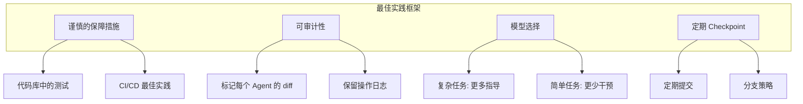

### 6.2 核心原则

| 原则 | 描述 |
|------|------|
| **保障措施** | 测试、CI/CD、安全检查 |
| **可审计性** | 标记每个 Agent 的 diff，保留日志 |
| **模型选择** | 不同任务使用不同模型 |
| **定期 Checkpoint** | 频繁提交，便于回滚 |

### 6.3 开放问题

1. **自动化研究阶段**
   > 如何自动化任何任务的前 10-20% 研究阶段？

2. **任务队列管理**
   > 如何维护待处理任务队列（对于一次性修改更容易）？

---

## 7. Anthropic 内部实践案例

> 基于 **How Anthropic Uses Claude Code** 阅读材料

### 7.1 各团队 Claude Code 应用场景

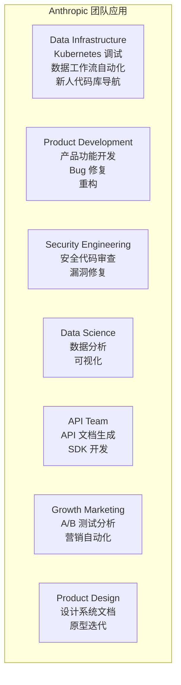

| 团队 | 应用场景 |
|------|----------|
| **Data Infrastructure** | Kubernetes 调试、数据工作流自动化、新人代码库导航 |
| **Product Development** | 产品功能开发、Bug 修复、重构 |
| **Security Engineering** | 安全代码审查、漏洞修复 |
| **Data Science** | 数据分析、可视化 |
| **API Team** | API 文档生成、SDK 开发 |
| **Growth Marketing** | A/B 测试分析、营销自动化 |
| **Product Design** | 设计系统文档、原型迭代 |

### 7.2 最佳实践要点（来自 Anthropic 团队）

1. **详细的 CLAUDE.md 文件** - 越详细的文档，Claude Code 表现越好
2. **使用 MCP 服务器** - 扩展 Claude Code 能力
3. **截图辅助** - 用截图展示期望的界面
4. **增量开发** - 一次实现一个步骤
5. **会话末文档** - 总结完成的工作，改进工作流

---

## 8. 关键教训

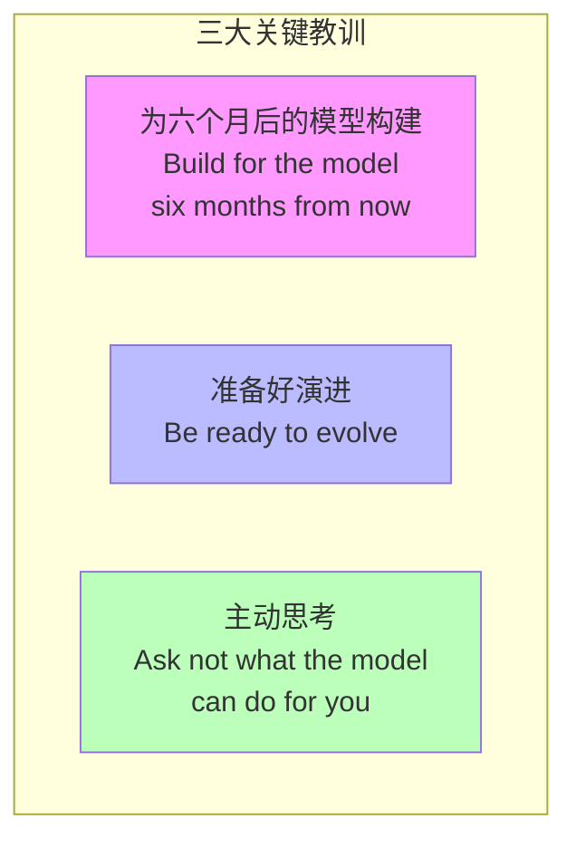

### 8.1 核心洞察

1. **Build for the model six months from now**
   - 模型能力快速提升
   - 今天的设计要考虑未来的能力

2. **Be ready to evolve**
   - 工具和方法论快速变化
   - 保持学习和适应能力

3. **Ask not what the model can do for you**
   - 思考如何为模型提供更好的上下文
   - 主动优化工作流程

### 8.2 生产力趋势

- **编程语言生产力**：正以指数级增长（AI 驱动）
- **IDE 生产力**：也呈类似指数级增长
- **验证方法**：AI 驱动的测试正在成为主流

---

## 9. 实践练习

### 练习 1: 配置 CLAUDE.md
创建项目的 CLAUDE.md，包含：
- 项目简介
- 常用命令
- 代码风格
- 测试说明

### 练习 2: 使用 Claude Code
1. 安装 Claude Code
2. 探索代码库
3. 尝试编写代码
4. 实践不同的工作流模式

### 练习 3: 添加 MCP
尝试添加一个 MCP Server，如：
```bash
claude mcp add barley_server -- node myserver
```

### 练习 4: 配置 Hooks
创建一个 PreToolUse hook，在文件修改前进行验证。

### 练习 5: 使用 Subagents
尝试为不同任务创建专门的 subagent 配置。

---

## 讲座资料

### Lecture 7: How to be an Agent Manager
- [Slides (PDF)](../slides/week4-lecture1-agent-manager.pdf)
- **Guest Speaker**: Boris Cherny, Anthropic（Claude Code 创始人）
- **日期**: 10/17/25

### Lecture 8: Welcome to Claude Code
- [Slides (PDF)](../slides/week4-lecture2-claude-code.pdf)
- **Speaker**: Boris Cherny
- **核心**: Claude Code 架构、使用场景、最佳实践

---

## 阅读材料

### 必读
1. **[Claude Code 官方文档](https://docs.anthropic.com/en/docs/claude-code)**
2. **[How Anthropic Uses Claude Code (PDF)](../readings/how-anthropic-uses-claude-code.pdf)**

### 推荐资源
1. **[Awesome Claude Agents](https://github.com/vijaythecoder/awesome-claude-agents)**
2. **[SuperClaude Framework](https://github.com/SuperClaude-Org/SuperClaude_Framework)**

---

## 作业

**[Chapter 4 Assignment](https://github.com/mihail911/modern-software-dev-assignments/tree/master/week4)**

实践 Agent 管理技巧，创建自定义工作流。

---

## 下一章

[下一章：Chapter 5](./chapter5.md)

---