# Chapter 2: Coding Agent Architecture

## Course Overview

Agents are the core capability of AI programming. Understanding the underlying principles helps you use tools better.

### Learning Objectives
- Understand core components of Agent architecture
- Master tool use and function calling mechanisms
- Learn MCP (Model Context Protocol)
- Build a simple Coding Agent from scratch

---

## 1. What is a Coding Agent?

```
Agent = LLM + Tools + Loop
```

- **LLM** is responsible for reasoning and decision-making
- **Tools** allow agents to interact with the world
- **Loop** enables the agent to continue working until the task is complete

### Agent Architecture Core Steps

```
1. Read user input → append to conversation
2. Tell LLM available tools (Read_file, List_dir, Edit_file, Create_file)
3. LLM requests tool use at appropriate time
4. Execute tool locally and return result
5. Continue conversation until task is complete
```

---

## 2. Agent Architecture Deep Dive

### 2.1 Overall Architecture

The core of an Agent is a **Perceive-Think-Act** loop system, also known as the **ReAct (Reasoning + Acting)** pattern.

```mermaid
graph TB
    subgraph "Agent System Architecture"
        User[👤 User] -->|Input Request| InputProcessor[Input Processor]

        subgraph "Core Loop Agent Loop"
            InputProcessor -->|Format Message| Context[Context Manager]
            Context -->|Build Prompt| LLM[🧠 LLM Engine]

            LLM -->|Think/Decide| Decision{Need Tool?}

            Decision -->|Yes| ToolSelector[Tool Selector]
            ToolSelector -->|Execute| Tools[🔧 Tool Set]
            Tools -->|Result| Context

            Decision -->|No| Response[Response Generator]
        end

        Response -->|Output| User

        subgraph "External Resources"
            Tools --> FileSystem[File System]
            Tools --> WebAPI[Web API]
            Tools --> Database[Database]
            Tools --> Terminal[Terminal Commands]
        end
    end

    style LLM fill:#f9f,stroke:#333,stroke-width:2px
    style Context fill:#bbf,stroke:#333,stroke-width:2px
    style Tools fill:#bfb,stroke:#333,stroke-width:2px
```



### 2.2 Core Components

| Component | Responsibility | Key Features |
|-----------|----------------|--------------|
| **Input Processor** | Parse user requests, extract intent | Support multiple input formats |
| **Context Manager** | Manage conversation history and state | Context window optimization |
| **LLM Engine** | Core decision-making and reasoning | Support multiple models |
| **Tool Selector** | Select appropriate tools based on intent | Dynamic tool discovery |
| **Tool Set** | Execute specific operations | Extensible architecture |
| **Response Generator** | Generate final responses | Multiple output formats |

---

## 3. Agent Loop Deep Dive

### 3.1 Agent Loop Workflow

The Agent Loop is the core execution mechanism that determines how an Agent iteratively processes tasks.


### 3.2 Agent Loop Pseudocode Implementation

```python
def agent_loop(user_input: str, tools: list[Tool], max_iterations: int = 10):
    """
    Agent main loop implementation
    """
    # 1. Initialize context
    messages = [
        {"role": "system", "content": SYSTEM_PROMPT},
        {"role": "user", "content": user_input}
    ]

    # 2. Start loop
    for iteration in range(max_iterations):
        # 3. Call LLM
        response = llm.chat(
            messages=messages,
            tools=tools,  # Tell LLM available tools
        )

        # 4. Check if tool call is needed
        if response.tool_calls:
            # 5. Execute all tool calls
            for tool_call in response.tool_calls:
                # Execute tool
                result = execute_tool(tool_call.name, tool_call.args)

                # Append result to message history
                messages.append({
                    "role": "tool",
                    "tool_call_id": tool_call.id,
                    "content": result
                })

            # Continue loop, let LLM process tool results
            continue

        # 6. If no tool call, check if complete
        if is_task_complete(response):
            return response.content

        # 7. Otherwise continue conversation
        messages.append({"role": "assistant", "content": response.content})

    return "Max iterations reached, task incomplete"
```

### 3.3 Key Loop Parameters

| Parameter | Description | Recommended Value |
|-----------|-------------|-------------------|
| `max_iterations` | Maximum iterations to prevent infinite loops | 10-50 |
| `timeout` | Timeout for single LLM call | 30-120s |
| `context_window` | Context window size | Depends on model |
| `retry_count` | Error retry count | 3 |

---

## 4. Tool Calling Mechanism Deep Dive

### 4.1 Tool Calling Flow


### 4.2 Tool Definition Format

Tools are defined using JSON Schema, including name, description, and parameter specification:

```json
{
  "name": "read_file",
  "description": "Read file content at specified path",
  "parameters": {
    "type": "object",
    "properties": {
      "file_path": {
        "type": "string",
        "description": "Absolute path of the file"
      },
      "offset": {
        "type": "integer",
        "description": "Starting line number, optional"
      },
      "limit": {
        "type": "integer",
        "description": "Number of lines to read, optional"
      }
    },
    "required": ["file_path"]
  }
}
```

### 4.3 Tool Call Example

```json
// LLM requests tool call
{
  "tool_calls": [
    {
      "id": "call_abc123",
      "type": "function",
      "function": {
        "name": "read_file",
        "arguments": "{\"file_path\": \"/src/main.py\"}"
      }
    }
  ]
}

// Tool execution result returned to LLM
{
  "role": "tool",
  "tool_call_id": "call_abc123",
  "content": "def main():\n    print('Hello, World!')\n"
}
```

### 4.4 Multi-Tool Collaboration Flow


---

## 5. Message Types and Context Management

### 5.1 Message Types


### 5.2 Context Window Management Strategies

| Strategy | Description | Use Case |
|----------|-------------|----------|
| **Sliding Window** | Keep last N messages | Simple conversations |
| **Summarization** | Compress history into summary | Long conversations |
| **Semantic Retrieval** | Retrieve relevant historical messages | Complex tasks |
| **Priority Queue** | Keep messages by importance | Multi-task scenarios |

---

## 6. Terminology

| Term | Description |
|------|-------------|
| **System Prompt** | Defines overall LLM behavior and some directives |
| **User Prompt** | User's custom requests |
| **Assistant Prompt** | LLM's response |
| **Tool Call** | Tool call request initiated by LLM |
| **Tool Result** | Result returned after tool execution |
| **Context Window** | Maximum tokens LLM can process |
| **Agent Loop** | Iterative execution loop of Agent |

### Claude's Secret Sauce

1. **Front-load context** - Use tiny targeted prompts to preload context
2. **System-reminder tags** - Use <system-reminder> everywhere to prevent drift
3. **Command prefix extraction** - Clearly extract user commands
4. **Subagents** - Spawn subagents to help prevent context overloading

---

## 7. Tool Use and Function Calling

### Function Calling Principle

```json
{
  "name": "get_weather",
  "description": "Get weather information for specified city",
  "parameters": {
    "type": "object",
    "properties": {
      "city": { "type": "string", "description": "City name" }
    },
    "required": ["city"]
  }
}
```

### Common Tools
- **Read_file** - Read file content
- **List_dir** - List directory contents
- **Edit_file** - Edit files
- **Create_file** - Create new files

### Workflow

1. Define tool name, description, and parameter schema
2. LLM decides when to call tools based on user request
3. Execute tool and return result to LLM
4. LLM continues generating responses or requesting more tools

---

## 8. MCP (Model Context Protocol)

### 8.1 Why MCP?

- LLMs have vast but static world knowledge that only updates when retrained
- Building fully autonomous systems requires robust ways to feed dynamic data

**Dynamic Data Examples**:
- What's the weather today?
- Who is the president?
- What's the price of Bitcoin?
- Who is the narrator in Nike's latest ad campaign?

RAG and tool-calling are the best answers we have today.

### 8.2 MCP Definition

> Model Context Protocol: A protocol that allows systems to provide context to AI models in a generalizable way

### 8.3 MCP Overall Architecture

```mermaid
graph TB
    subgraph "MCP Architecture Layers"
        subgraph "Application Layer"
            Host[🏠 Host<br/>Claude Desktop / Cursor]
        end

        subgraph "Protocol Layer"
            Client[📡 MCP Client<br/>Session Management]
            Server[🔧 MCP Server<br/>Tool Wrapper]
        end

        subgraph "Resource Layer"
            Tool1[📄 File System]
            Tool2[🌐 Web API]
            Tool3[💾 Database]
            Tool4[🖥️ Shell]
        end
    end

    Host <-->|JSON-RPC| Client
    Client <-->|stdio/SSE| Server
    Server --> Tool1
    Server --> Tool2
    Server --> Tool3
    Server --> Tool4

    style Host fill:#f9f,stroke:#333,stroke-width:2px
    style Client fill:#bbf,stroke:#333,stroke-width:2px
    style Server fill:#bfb,stroke:#333,stroke-width:2px
```



### 8.4 MCP Communication Flow Deep Dive


### 8.5 MCP Benefits

| Benefit | Description |
|---------|-------------|
| **Standardization** | Unified tool description format using JSON-RPC |
| **Extensibility** | MCP Server can wrap any tool |
| **Reduced Integration** | M x N → M + N |
| **Inherited from LSP** | Extends from Language Server Protocols |
| **Proactive Workflows** | Supports proactive agentic workflows, not just reactive responses |

### 8.6 MCP Core Components

| Component | Description |
|-----------|-------------|
| **Host** | AI IDEs like Cursor, Claude Desktop |
| **MCP Client** | Library embedded in Host (stateful session per server) |
| **MCP Server** | Lightweight wrapper in front of a tool |
| **Tool** | Callable function (could be data source, API) |

### 8.7 MCP Tool Definition Example

```json
{
  "name": "read_file",
  "description": "Read the contents of a local file",
  "inputSchema": {
    "type": "object",
    "properties": {
      "path": {
        "type": "string",
        "description": "The path of the file to read"
      }
    },
    "required": ["path"]
  }
}
```

### 8.8 MCP Transport Layer


### 8.9 MCP Limitations

- **Limited tool handling**: Agents don't handle many tools well
- **Context window consumption**: APIs eat up context window quickly
- **AI-native design**: Design APIs with AI usage in mind

---

## 9. Building a Coding Agent from Scratch: The 200-Line Secret

> This section is based on Mihail Eric's article ["The Emperor Has No Clothes: How to Code Claude Code in 200 Lines of Code"](https://www.mihaileric.com/The-Emperor-Has-No-Clothes/)

### 9.1 The Core Insight

Today's AI coding assistants feel like magic. You describe what you want in barely coherent English, and they read files, edit your project, and write functional code.

But here's the truth: **the core of these tools isn't magic. It's about 200 lines of straightforward Python.**

### 9.2 The Mental Model

The key to understanding a Coding Agent is realizing it's essentially just a **conversation with an LLM that has a toolbox**:


**Key insight**: The LLM never actually touches your filesystem. It just asks for things to happen, and your code makes them happen.

### 9.3 Three Core Tools

A minimal Coding Agent only needs three tools:

| Tool | Function | Necessity |
|------|----------|-----------|
| **read_file** | Read file contents | Let LLM see your code |
| **list_files** | List directory contents | Let LLM navigate project structure |
| **edit_file** | Edit/create files | Let LLM modify code |

Production agents (like Claude Code) have more tools (grep, bash, websearch, etc.), but three tools are enough to do incredible work.

### 9.4 Code Implementation

#### Basic Setup

```python
import inspect
import json
import os
import anthropic
from dotenv import load_dotenv
from pathlib import Path
from typing import Any, Dict, List, Tuple

load_dotenv()
claude_client = anthropic.Anthropic(api_key=os.environ["ANTHROPIC_API_KEY"])

# Terminal color output
YOU_COLOR = "\u001b[94m"
ASSISTANT_COLOR = "\u001b[93m"
RESET_COLOR = "\u001b[0m"

def resolve_abs_path(path_str: str) -> Path:
    """Convert relative path to absolute path"""
    path = Path(path_str).expanduser()
    if not path.is_absolute():
        path = (Path.cwd() / path).resolve()
    return path
```

#### Tool 1: Read File

```python
def read_file_tool(filename: str) -> Dict[str, Any]:
    """
    Gets the full content of a file provided by the user.
    :param filename: The name of the file to read.
    :return: The full content of the file.
    """
    full_path = resolve_abs_path(filename)
    with open(str(full_path), "r") as f:
        content = f.read()
    return {
        "file_path": str(full_path),
        "content": content
    }
```

#### Tool 2: List Files

```python
def list_files_tool(path: str) -> Dict[str, Any]:
    """
    Lists the files in a directory provided by the user.
    :param path: The path to a directory to list files from.
    :return: A list of files in the directory.
    """
    full_path = resolve_abs_path(path)
    all_files = []
    for item in full_path.iterdir():
        all_files.append({
            "filename": item.name,
            "type": "file" if item.is_file() else "dir"
        })
    return {
        "path": str(full_path),
        "files": all_files
    }
```

#### Tool 3: Edit File

```python
def edit_file_tool(path: str, old_str: str, new_str: str) -> Dict[str, Any]:
    """
    Replaces first occurrence of old_str with new_str in file.
    If old_str is empty, create/overwrite file with new_str.
    """
    full_path = resolve_abs_path(path)
    if old_str == "":
        full_path.write_text(new_str, encoding="utf-8")
        return {"path": str(full_path), "action": "created_file"}

    original = full_path.read_text(encoding="utf-8")
    if original.find(old_str) == -1:
        return {"path": str(full_path), "action": "old_str not found"}

    edited = original.replace(old_str, new_str, 1)
    full_path.write_text(edited, encoding="utf-8")
    return {"path": str(full_path), "action": "edited"}
```

#### Tool Registry

```python
TOOL_REGISTRY = {
    "read_file": read_file_tool,
    "list_files": list_files_tool,
    "edit_file": edit_file_tool
}
```

#### System Prompt

```python
SYSTEM_PROMPT = """
You are a coding assistant whose goal it is to help us solve coding tasks.
You have access to a series of tools you can execute. Here are the tools you can execute:
{tool_list_repr}
When you want to use a tool, reply with exactly one line in the format:
'tool: TOOL_NAME({{JSON_ARGS}})' and nothing else.
Use compact single-line JSON with double quotes. After receiving a tool_result(...)
message, continue the task.
If no tool is needed, respond normally.
"""
```

#### Parsing Tool Calls

```python
def extract_tool_invocations(text: str) -> List[Tuple[str, Dict[str, Any]]]:
    """
    Extract tool calls from lines in 'tool: name({...})' format
    """
    invocations = []
    for raw_line in text.splitlines():
        line = raw_line.strip()
        if not line.startswith("tool:"):
            continue
        try:
            after = line[len("tool:"):].strip()
            name, rest = after.split("(", 1)
            name = name.strip()
            if not rest.endswith(")"):
                continue
            json_str = rest[:-1].strip()
            args = json.loads(json_str)
            invocations.append((name, args))
        except Exception:
            continue
    return invocations
```

#### Agent Loop

```python
def run_coding_agent_loop():
    conversation = [{
        "role": "system",
        "content": get_full_system_prompt()
    }]

    while True:
        # Get user input
        user_input = input(f"{YOU_COLOR}You:{RESET_COLOR}:")
        conversation.append({
            "role": "user",
            "content": user_input.strip()
        })

        # Inner loop: handle tool calls
        while True:
            assistant_response = execute_llm_call(conversation)
            tool_invocations = extract_tool_invocations(assistant_response)

            if not tool_invocations:
                # No tool call, output response
                print(f"{ASSISTANT_COLOR}Assistant:{RESET_COLOR}: {assistant_response}")
                conversation.append({
                    "role": "assistant",
                    "content": assistant_response
                })
                break

            # Execute all tool calls
            for name, args in tool_invocations:
                tool = TOOL_REGISTRY[name]
                result = tool(**args)
                conversation.append({
                    "role": "user",
                    "content": f"tool_result({json.dumps(result)})"
                })
```

### 9.5 Running Example

```
You: Create a hello.py file with hello world implementation

Agent calls: edit_file(path="hello.py", old_str="", new_str="print('Hello World')")

Assistant: Done! Created hello.py with hello world implementation.

You: Edit hello.py and add a function to multiply two numbers

Agent calls: read_file(filename="hello.py")  # Check current content
Agent calls: edit_file(path="hello.py", old_str="...", new_str="...")

Assistant: Added multiply function to hello.py.
```

### 9.6 Comparison with Production Tools

| Feature | Our Implementation | Production Tools like Claude Code |
|---------|-------------------|-----------------------------------|
| Core Loop | ✓ Same | ✓ Same |
| Error Handling | Basic | Comprehensive |
| Streaming Output | ✗ | ✓ |
| Context Management | Basic | Smart (summarize long files, etc.) |
| Tool Count | 3 | More (bash, grep, websearch, etc.) |
| Approval Workflow | ✗ | ✓ (confirm destructive operations) |
| Lines of Code | ~200 | Thousands |

**Key Conclusion**: Production tools add many engineering details, but the core architecture is exactly this loop—LLM decides what to do, code executes it, results flow back. That's the whole architecture.

### 9.7 Key Takeaways

1. **Tool descriptions matter**: Function docstrings are used directly to tell LLM how to use tools
2. **Structured returns**: Tools return dictionaries; LLM needs structured context
3. **Convention over configuration**: E.g., `old_str=""` means create new file
4. **The loop is everything**: Outer loop gets user input, inner loop handles tool call chains

---

## 10. Practice Exercises

### Exercise 1: Understand Agent Loop
Observe how Agent in Claude or Cursor:
1. Receives user requests
2. Decides which tools to use
3. Executes tools and processes results
4. Continues until task is complete

### Exercise 2: Explore MCP
1. View available MCPs in Cursor or Claude Desktop
2. Try adding a new MCP Server
3. Observe how tools are described to LLM

### Exercise 3: Build Simple Agent
Try building a simple Coding Agent from scratch:
1. Set up LLM API
2. Define available tools
3. Implement agent loop
4. Test basic functionality

### Exercise 4: Extend Agent Functionality
Based on Section 9's code, try adding these features:
1. Add `grep_search` tool to search code content
2. Add `run_bash` tool to execute commands
3. Implement streaming output
4. Add operation confirmation mechanism

---

## Lecture Materials

### Lecture 3: Building a coding agent from scratch
- [Slides (PDF)](../slides/week2-lecture1-coding-agent-scratch.pdf)

### Lecture 4: Building a custom MCP server
- [Slides (PDF)](../slides/week2-lecture2-mcp-server.pdf)

---

## Reading Materials

1. **[The Emperor Has No Clothes: How to Code Claude Code in 200 Lines of Code](https://www.mihaileric.com/The-Emperor-Has-No-Clothes/)** - Mihail Eric
2. **[MCP Introduction](https://stytch.com/blog/model-context-protocol-introduction/)**
3. **[Sample MCP Server Implementations](https://github.com/modelcontextprotocol/servers)**

---

## Assignment

**[Chapter 2 Assignment](https://github.com/mihail911/modern-software-dev-assignments/tree/master/week2)**

Complete development tasks in AI IDE.

---

## Next Chapter

[Next Chapter: Chapter 3](./chapter3.md)

---