# Chapter 3: AI Integrated Development Environment

## Course Overview

AI IDE is fundamentally about augmentation, not replacement. Context quality determines output quality.

### Learning Objectives
- Understand how AI IDE works
- Master AI IDE best practices
- Learn sync vs async tool usage scenarios
- Understand 2025 programming workflows

---

## 1. Why IDE?

### 1.1 Definition of IDE

**IDE (Integrated Development Environment)** is an all-in-one workspace for software development, containing:
- Code editor
- Compiler
- Debugger
- More development tools

### 1.2 Why AI-Enhanced IDE is a Natural Evolution


### 1.3 Core Tension in IDE Evolution

IDE evolution always has a tension between:

| Direction | Description |
|-----------|-------------|
| **Functionality Consolidation** | Integrating more features into one tool |
| **Developer Customization** | Allowing developers to freely choose and configure tools |

---

## 2. AI IDE Development History

### 2.1 Timeline


### 2.2 Key Milestones

| Year | Product | Core Innovation |
|------|---------|-----------------|
| 1980 | Turbo Pascal | First true IDE, integrated editing, compiling, debugging |
| 1997 | Visual Studio | Advanced debugging capabilities for C++/Visual Basic |
| 2001 | IntelliJ IDEA | Contextual code navigation, refactoring, intelligent completion |
| 2015 | VSCode | Lightweight + highly extensible ecosystem |
| 2023 | Cursor | One of first widely used AI-native IDEs |

---

## 3. Two Modes of AI IDE

### 3.1 Bread-and-butter Modes


| Mode | Description | Typical Use Case |
|------|-------------|------------------|
| **Inline** | Inline code completion | Quickly complete single lines |
| **Function** | Function-level generation | Generate entire function implementations |
| **Single-file** | Single file operations | Refactor a single file |
| **Multi-file** | Multi-file operations | Cross-file refactoring and modifications |

### 3.2 True AI-native Modes


| Feature | Description |
|---------|-------------|
| **Background Agents** | AI agents running in background, can process multiple tasks in parallel |
| **MCP Integration** | Integrate MCP protocol to extend tool capabilities |
| **Learn Memories** | AI learns and remembers project-specific context |
| **Bugbot** | Automatic PR review, discover potential issues |

---

## 4. How AI IDE Works

### 4.1 Tab Complete (Code Completion)


**Workflow:**
1. Small context window around current code is encrypted
2. Server receives and runs infilling LLM
3. Suggestion sent back and displayed to user

### 4.2 Chat Mode


**Key Technologies:**

| Technology | Description |
|------------|-------------|
| **Code Chunking** | Split code into semantic units for storage |
| **Embeddings** | Vector representations of code blocks, supporting semantic search |
| **Semantic Index** | Index structure supporting fuzzy search |
| **Merkle Trees** | Efficiently compute code diffs, optimize syncing |
| **Filename Obfuscation** | Protect privacy, don't expose real filenames |

### 4.3 Context Management


---

## 5. Sync vs Async Tools

### 5.1 Three Eras of AI Coding Tools


| Era | Tool Type | Representative Products | Efficiency Gain | Characteristics |
|-----|-----------|------------------------|-----------------|-----------------|
| 1 | Code Completion | GitHub Copilot | ~10% | Code completion, local development |
| 2 | IDE Automation | Cursor, Windsurf | ~20% | Single task completion, local sync |
| 3 | AI Software Engineer | Devin | 6-12x | Multi-task parallel, cloud async |

### 5.2 Synchronous (Sync) Mode

```mermaid
graph TB
    subgraph "Sync Mode"
        User[👤 User] <-->|Single-threaded interaction| Agent[🤖 AI Agent]
        Agent -->|Work 20s - 1.5min| Task[Single Task]
    end

    style User fill:#bbf
    style Agent fill:#f9f
```



**Characteristics:**
- **Single-threaded**: Process one task at a time
- **Human-in-the-loop**: Human continuously participates in decisions
- **Focused attention**: Concentrated on one task
- **AI work time**: 20 seconds - 1.5 minutes
- **Maintain flow state**

**Local Tools**: Windsurf, Cursor

### 5.3 Asynchronous (Async) Mode

```mermaid
graph TB
    subgraph "Async Mode - 10x Parallelism"
        User[👤 User] -->|Delegate| A1[Agent 1]
        User -->|Delegate| A2[Agent 2]
        User -->|Delegate| A3[Agent 3]

        A1 -->|Work 10min - hours| T1[Task 1]
        A2 --> T2[Task 2]
        A3 --> T3[Task 3]
    end

    style User fill:#bbf
    style A1 fill:#f9f
    style A2 fill:#f9f
    style A3 fill:#f9f
```



**Characteristics:**
- **Multi-threaded**: Process multiple tasks simultaneously
- **Human delegates**: Human assigns tasks then switches attention
- **Attention switching**: Flow between multiple tasks
- **AI work time**: 10 minutes - multiple hours
- **10x parallelism**

**Cloud Tools**: Devin, DeepWiki, Codemaps

### 5.4 Local vs Cloud Comparison

```mermaid
graph TB
    subgraph "Local AI IDE"
        L1[User] --> L2[Local IDE]
        L2 --> L3[Local Environment]

        L_Note[Local • Synchronous • 1-to-1 • Isolated Knowledge]
    end

    subgraph "Cloud AI Agent"
        C1[User] --> C2[Cloud Agent 1]
        C1 --> C3[Cloud Agent 2]
        C2 --> C4[VPC Environment 1]
        C3 --> C5[VPC Environment 2]

        C_Note[Cloud • Asynchronous • 1-to-Many • Organizational Knowledge]
    end

    style L_Note fill:#bfb
    style C_Note fill:#f9f
```



| Dimension | Local AI IDE | Cloud AI Agent |
|-----------|--------------|----------------|
| Location | Local | Cloud VPC |
| Mode | Synchronous | Asynchronous |
| Relationship | 1-to-1 | 1-to-Many |
| Knowledge | Isolated | Organization-level shared |
| Use Case | Boost individual speed | Unlimited parallel capacity |

### 5.5 Semi-Async Trap


**Problems with Semi-Async:**
- **Too slow**: Cannot maintain flow state
- **Too short**: Cannot multi-task
- **Recommendation**: Avoid! Either speed up to sync or extend to async

### 5.6 Challenges of Using Async Agents

> "Managing async agents can unlock 10x gains… but most people use sync agents."

**Why do most people use sync tools?**

1. **Management is hard** - Whether for humans or agents
2. **Requires multi-tasking** - Switch between different contexts quickly
3. **Requires quick context understanding** - Rapidly grasp new task backgrounds

---

## 6. 2025 Programming Workflow

### 6.1 Workflow Overview


### 6.2 Planning Phase

**Recommended Tools:**
- DeepWiki - Codebase understanding and documentation
- Ask Devin - Get AI planning suggestions
- Codemaps - Code structure mapping
- DeepWiki in Windsurf - Local code understanding

### 6.3 Coding Phase

**Async Delegation:**
```
1. Delegate task to Devin (async)
2. AI Agent independently completes coding work
3. Human can handle other tasks
```

### 6.4 Testing Phase

**Common Workflow:**
```
1. Delegate task to Devin (async)
2. Test and refine changes in Windsurf (sync)
```

**Future Outlook:**
> If async agents could test autonomously, leverage would further increase. This is slowly becoming reality.

### 6.5 Future Evolution


---

## 7. Best Practices

### 7.1 Writing Effective Task Descriptions

For simple changes, you don't need overly detailed prompts. But for complex tasks, you need to become a **product manager** and write detailed spec documents.


| Element | Question | Description |
|---------|----------|-------------|
| **Goal** | What is the purpose of the change? | Clear goal statement |
| **Definitions** | What special cases need to be accounted for? | Boundary conditions and definitions |
| **Out-of-scope** | What should *not* be changed? | Clear scope limitations |
| **Test cases** | How will testing be done? | Testing strategy and methods |
| **Plan** | High-level implementation breakdown | Implementation steps overview |
| **Edge cases** | What parts of the codebase are relevant and why? | Boundary conditions to note |
| **Source files** | Source files being changed | Specific file list |
| **Prereqs** | What prereqs does the LLM need to know about the problem? | Background knowledge |
| **Extensions** | What changes will be relevant later? | Future design considerations |

### 7.2 Optimizing Your Codebase

> "Optimize your codebase so that a human and an agent could understand what's going on"

**Main source of LLM confusion**: Trying to complete tasks with a messy repo as context.

**Optimization Dimensions:**

| Dimension | Content |
|-----------|---------|
| **Descriptive** | Repo orientation, file structure |
| **Runnable** | Setup and environment configuration |
| **Consistent** | Best practices, code style |
| **Accessible** | Access patterns, APIs and contracts |

**Tip**: A monorepo design in your repo is highly encouraged.

### 7.3 Navigation File Configuration

Configuration files to help LLMs navigate your codebase:

| File | Purpose | Example Content |
|------|---------|-----------------|
| **CLAUDE.md** | Context file auto-loaded by Claude | Common commands, core files, code style, testing instructions |
| **cursorrules** | Cursor's rule configuration | Project-specific rules and preferences |
| **AGENTS.md** | Open format for Agent instructions | General Agent guidance |
| **llms.txt** | Navigation guidance for LLMs scraping the web | Web-accessible project documentation |

**CLAUDE.md Example:**

```markdown
# Project Overview
Brief description of the project

## Common Commands
- `npm run dev`: Start development server
- `npm test`: Run tests
- `npm run build`: Build for production

## Core Files
- `src/index.ts`: Entry point
- `src/api/`: API handlers
- `src/utils/`: Utility functions

## Code Style
- Use TypeScript
- Follow ESLint rules
- Write tests for new features

## Testing
- Run `npm test` before committing
- Add tests for bug fixes
```

**Note**: Agents won't always adhere to these descriptions/directives. They are intended as guidance.

---

## 8. Future Outlook

### 8.1 New Role of Human Engineers

```mermaid
graph TB
    subgraph "Engineer as Agent Manager"
        Manager[👤 Human Engineer]
        Sync_Tools[Sync Tools<br/>Solve hardest problems]
        Async_Tools[Async Tools<br/>Achieve 10x leverage]

        Manager --> Sync_Tools
        Manager --> Async_Tools
    end

    style Manager fill:#f9f
    style Sync_Tools fill:#bbf
    style Async_Tools fill:#bfb
```



**Human engineers will become Agent managers:**
1. Leverage sync tools to solve the most difficult problems
2. Leverage async tools to achieve 10x leverage

### 8.2 Essential Future Skills

| Skill | Description |
|-------|-------------|
| **Delegation & Multi-threading** | Effectively assign tasks to multiple Agents |
| **Code Reading** | Quickly understand and review AI-generated code |
| **Planning, Scoping, Architecting** | High-level design and decision-making abilities |

---

## 9. Practice Exercises

### Exercise 1: Configure CLAUDE.md
Create a CLAUDE.md file containing:
- Project introduction
- Common commands
- Code style guidelines
- Testing instructions

### Exercise 2: Try Sync/Async Tools
1. Use Windsurf for sync coding
2. Use Devin for async tasks
3. Compare user experience
4. Practice switching between multiple async tasks

### Exercise 3: Explore AI IDE Features
1. Try Tab Complete
2. Try Chat mode
3. Explore MCP integration
4. Test Background Agents

### Exercise 4: Write Task Description
Write a detailed task description for a medium-complexity task, including all 9 elements.

---

## Lecture Materials

### Lecture 5: The AI IDE: Fundamentals to Power User
- [Slides (PDF)](../slides/week3-lecture1-ide-setup.pdf)
- **Guest Speaker**: Silas Alberti, Cognition (Head of Research)
- **Date**: 10/10/25, 8:30am PT, 420-041

### Lecture 6: IDE ❤ Agents - An opinionated guide to AI coding in 2025
- [Slides (PDF)](../slides/week3-lecture2-cognition.pdf)
- **Guest Speaker**: Silas Alberti, Founding Team @ Cognition
- **Core Content**: Sync vs async tools, 2025 programming workflow, future skills

---

## Reading Materials

1. **[Claude Code Documentation](https://docs.anthropic.com/en/docs/claude-code)**
2. **[Cursor Documentation](https://cursor.sh/docs)**
3. **[Devin Documentation](https://docs.devin.ai)**

---

## Assignment

**[Chapter 3 Assignment](https://github.com/mihail911/modern-software-dev-assignments/tree/master/week3)**

Familiarize with AI IDE environment and master best practices.

---

## Next Chapter

[Next Chapter: Chapter 4](./chapter4.md)

---