# Chapter 4: Programming Agent Patterns

## Course Overview

Developers are transitioning from "doing" to "managing". Subagents are the future trend: agents managing agents.

### Learning Objectives
- Understand Agent management design patterns
- Master Claude Code usage
- Learn Hooks, Commands, Subagents usage
- Understand Anthropic internal practices

---

## 1. Development Evolution Trend

### 1.1 Evolution of Developer Roles


| Stage | Role | Description |
|-------|------|-------------|
| 1 | Solo Developer | Single developer managing single developer's output |
| 2 | Team Lead | Lead managing many developers' output |
| 3 | AI-Assisted Team | Lead managing many developers' output (assisted by AI system) |
| 4 | Agent Manager | Single developer managing many AI agents' work |

### 1.2 History of Software Teams


| Year | Milestone | Key Change |
|------|-----------|------------|
| 1940 | Solo Developers | Single person handles full project |
| 1960 | First Teams | NASA, DoD project requirements |
| 1970 | Mainstream Adoption | Specialization emerges |
| 1990 | Engineering Maturity | Methodology and tool standardization |
| 2023 | Agent Group Management | Developers managing diverse agents |
| 2025 | AI Collaboration | Developers + AI coding systems |
| 2030 | Future Outlook | Agents managing agents |

---

## 2. Exponential Growth in Programming Productivity

### 2.1 Programming Language Productivity Evolution


**Key Insight**: Programming language productivity is increasing exponentially, driven by AI.

### 2.2 IDE Productivity Evolution


**Key Insight**: IDE productivity is following similar exponential growth, also driven by AI.

### 2.3 Verification Methods Evolution


---

## 3. Software Task Steps and Responsibility Distribution

### 3.1 Task Steps Overview

```mermaid
graph TB
    subgraph "Software Task Steps"
        R1[Provide high level requirements 🟩]
        R2[Convert requirements into design doc 🟩/🟦]
        R3[Implement solution from doc 🟦]
        R4[Add tests 🟦]
        R5[Ensure CI passes 🟦]
        R6[Code review 🟦]
        R7[Update docs 🟦]
    end

    R1 --> R2 --> R3 --> R4 --> R5 --> R6 --> R7

    style R1 fill:#bfb
    style R2 fill:#ff9
    style R3 fill:#bbf
    style R4 fill:#bbf
    style R5 fill:#bbf
    style R6 fill:#bbf
    style R7 fill:#bbf
```



### 3.2 Responsibility Distribution Legend

| Color | Meaning | Executor |
|-------|---------|----------|
| 🟩 Green | Human-led | Developer |
| 🟩/🟦 Yellow | Collaborative | Developer + Agent |
| 🟦 Blue | Agent-led | AI Agent |

---

## 4. Agent Management Techniques

### 4.1 Four Core Technologies


### 4.2 Hooks

> **Definition**: Deterministic scripts that run on predefined event types


**Hook Types:**

| Hook Type | Trigger Time | Typical Use |
|-----------|--------------|-------------|
| `PreToolUse` | Before tool use | Validate parameters, add constraints |
| `PostToolUse` | After tool use | Validate results, logging |
| `UserPromptSubmit` | When user submits prompt | Input preprocessing |
| `PreCompact` | Before context compaction | Preserve key information |
| `...` | More types | Continuously expanding |

### 4.3 Commands

> **Definition**: Provide frequently-used prompts as files for Agent to execute

**Use Cases:**

| Scenario | Description |
|----------|-------------|
| Running Tests | Automated test workflows |
| Code Review | Standardized review process |
| Git Operations | Standardized commit, push |
| Deployment | Automated deployment steps |

**Benefits:**
- Reuse high-frequency workflows
- Team standardization
- Reduce repetitive input

### 4.4 Subagents

> **Definition**: Runtime delegation, creating independent developer personas


**Purposes of Subagents:**

1. **Create Different Developer Personas**
   - Frontend specialist
   - Backend specialist
   - Testing specialist
   - Documentation specialist

2. **Cleanly Separate Contexts**
   - Independent workflow contexts
   - Avoid context pollution

3. **Provide Customization**
   - Custom system prompts
   - Dedicated tool sets
   - Separate context windows

4. **Move Toward Agents Managing Agents**
   - Hierarchical management
   - Specialized division of labor

**Reference Resources:**
- [Awesome Claude Agents](https://github.com/vijaythecoder/awesome-claude-agents)
- [SuperClaude Framework](https://github.com/SuperClaude-Org/SuperClaude_Framework)

### 4.5 Agent Behavior Files

| File | Tool | Purpose |
|------|------|---------|
| `CLAUDE.md` | Claude Code | Context auto-loaded by Claude |
| `cursorrules` | Cursor | Cursor rule configuration |
| `AGENTS.md` | General | Open format Agent instructions |

---

## 5. Claude Code Deep Guide

### 5.1 Claude Code's Approach


### 5.2 Covers the Entire SDLC


**Using your team's CLI tools**: git, docker, bq, etc. - focus on solutions, not syntax.

### 5.3 Multiple Interfaces


### 5.4 Installation

```bash
npm install -g @anthropic-ai/claude-code
```

### 5.5 Core Use Cases

#### Use Case 1: Codebase Q&A + Research


**Example Questions:**
```
> how do I make a new @app/services/ValidationTemplateFactory?
> why does recoverFromException take so many arguments? look through git history to answer
> why did we fix issue #18363 by adding the if/else in @src/login.ts api?
> in which version did we release the new @api/ext/PreHooks.php api?
> look at PR #9383, then carefully verify which app versions were impacted
> what did I ship last week?
```

#### Use Case 2: Write Code

| Mode | Description |
|------|-------------|
| **1-shot** | Single completion, suitable for simple tasks |
| **Sidekick** | Assistant mode, human-machine collaboration |
| **Prototype** | Rapid prototyping, iterative refinement |

#### Use Case 3: Integrate Tools & MCPs

```bash
# Add MCP Server
$ claude mcp add barley_server -- node myserver

# Use MCP
> use the barley mcp server to check for error logs
```

#### Use Case 4: Power Automation

Automate complex workflows, reduce repetitive work.

### 5.6 Workflow Adaptation to Tasks


**Workflow Examples:**

**Explore-Plan Type:**
```
> figure out the root cause for issue #983, then propose a few fixes.
  Let me choose an approach before you code. ultrathink
```

**Test-Driven Type:**
```
> write tests for @utils/markdown.ts to make sure links render properly
  (note the tests won't pass yet, since links aren't yet implemented).
  then commit. then update the code to make the tests pass.
```

**Prototype Iteration Type:**
```
> implement [mock.png]. Then screenshot it with puppeteer and iterate
  till it looks like the mock.
```

### 5.7 Prototype Iteration Example

Demonstrating how Claude Code rapidly iterates UI design:

```
> make it so instead of todos showing up as they come in, we hide the
  tool use and result for todos, and render a fixed todo list above
  the input. title it "/todo (1 of 3)" in grey

> actually don't show a todo list at all, and instead render the tool
  uses inline, as bold headings when the model starts working on a todo

> also add a todo pill under the text input, similar to bg tasks

> actually undo both the pill and headings. instead, make the todo list
  render to the right of the input, vertically centered with a grey divider

> instead of showing todos above the input, merge them into the spinner.
  show the current todo as the spinner message in active verb form
```

---

## 6. Best Practices

### 6.1 Safeguards


### 6.2 Core Principles

| Principle | Description |
|-----------|-------------|
| **Safeguards** | Tests, CI/CD, security checks |
| **Auditability** | Label every Agent's diff, retain logs |
| **Model Selection** | Use different models for different tasks |
| **Regular Checkpoints** | Frequent commits for easy rollback |

### 6.3 Open Questions

1. **Automating Research Phase**
   > How can we automate the first 10-20% research phase of any task?

2. **Task Queue Management**
   > How to maintain a queue of pending tasks (easier for one-off changes)?

---

## 7. Anthropic Internal Practices Case Study

> Based on **How Anthropic Uses Claude Code** reading material

### 7.1 Team Use Cases for Claude Code


| Team | Use Cases |
|------|-----------|
| **Data Infrastructure** | Kubernetes debugging, data workflow automation, onboarding code navigation |
| **Product Development** | Feature development, bug fixes, refactoring |
| **Security Engineering** | Security code review, vulnerability fixes |
| **Data Science** | Data analysis, visualization |
| **API Team** | API documentation generation, SDK development |
| **Growth Marketing** | A/B test analysis, marketing automation |
| **Product Design** | Design system documentation, prototype iteration |

### 7.2 Best Practices Highlights (from Anthropic Teams)

1. **Detailed CLAUDE.md files** - More detailed documentation = better Claude Code performance
2. **Use MCP servers** - Extend Claude Code capabilities
3. **Screenshot assistance** - Use screenshots to show expected interface
4. **Incremental development** - Implement one step at a time
5. **End-of-session documentation** - Summarize completed work, improve workflows

---

## 8. Key Lessons


### 8.1 Core Insights

1. **Build for the model six months from now**
   - Model capabilities are rapidly improving
   - Today's designs should consider future capabilities

2. **Be ready to evolve**
   - Tools and methodologies are changing rapidly
   - Maintain learning and adaptation abilities

3. **Ask not what the model can do for you**
   - Think about how to provide better context for the model
   - Proactively optimize workflows

### 8.2 Productivity Trends

- **Programming Language Productivity**: Increasing exponentially (AI-driven)
- **IDE Productivity**: Following similar exponential growth
- **Verification Methods**: AI-driven testing is becoming mainstream

---

## 9. Practice Exercises

### Exercise 1: Configure CLAUDE.md
Create a project CLAUDE.md containing:
- Project introduction
- Common commands
- Code style
- Testing instructions

### Exercise 2: Use Claude Code
1. Install Claude Code
2. Explore codebase
3. Try writing code
4. Practice different workflow patterns

### Exercise 3: Add MCP
Try adding an MCP Server:
```bash
claude mcp add barley_server -- node myserver
```

### Exercise 4: Configure Hooks
Create a PreToolUse hook to validate before file modifications.

### Exercise 5: Use Subagents
Try creating specialized subagent configurations for different tasks.

---

## Lecture Materials

### Lecture 7: How to be an Agent Manager
- [Slides (PDF)](../slides/week4-lecture1-agent-manager.pdf)
- **Guest Speaker**: Boris Cherny, Anthropic (Creator of Claude Code)
- **Date**: 10/17/25

### Lecture 8: Welcome to Claude Code
- [Slides (PDF)](../slides/week4-lecture2-claude-code.pdf)
- **Speaker**: Boris Cherny
- **Core**: Claude Code architecture, use cases, best practices

---

## Reading Materials

### Required
1. **[Claude Code Official Documentation](https://docs.anthropic.com/en/docs/claude-code)**
2. **[How Anthropic Uses Claude Code (PDF)](../readings/how-anthropic-uses-claude-code.pdf)**

### Recommended Resources
1. **[Awesome Claude Agents](https://github.com/vijaythecoder/awesome-claude-agents)**
2. **[SuperClaude Framework](https://github.com/SuperClaude-Org/SuperClaude_Framework)**

---

## Assignment

**[Chapter 4 Assignment](https://github.com/mihail911/modern-software-dev-assignments/tree/master/week4)**

Practice Agent management techniques and create custom workflows.

---

## Next Chapter

[Next Chapter: Chapter 5](./chapter5.md)

---