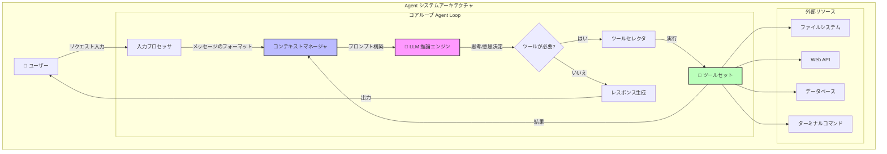
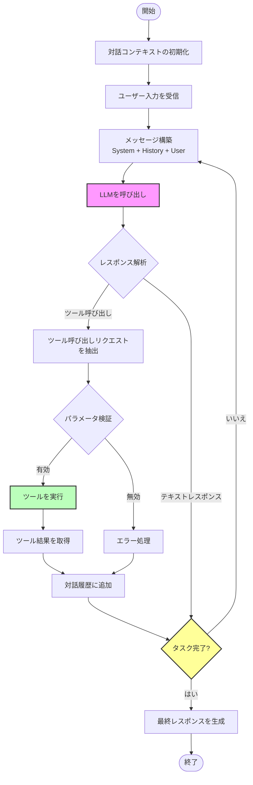
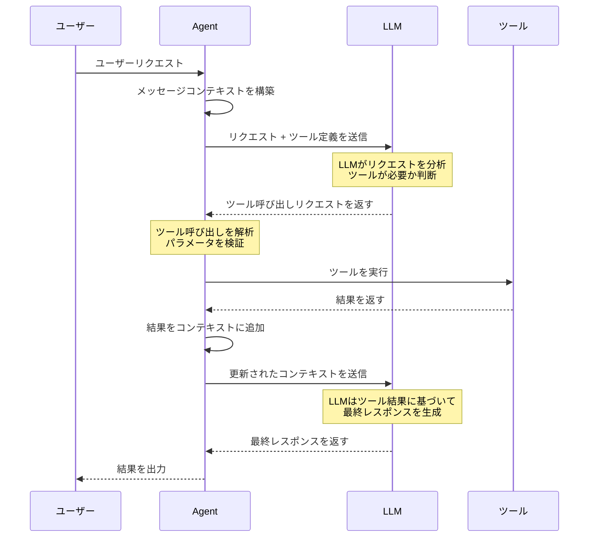
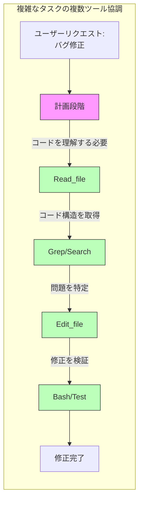
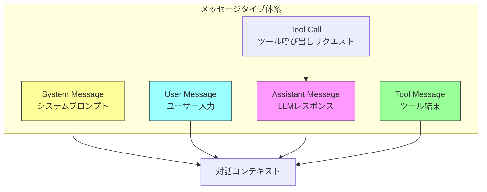
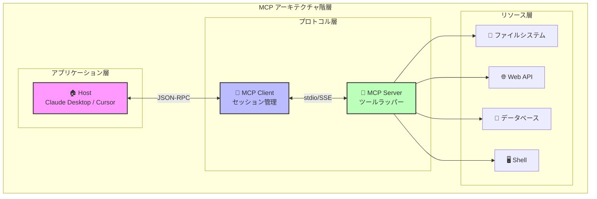
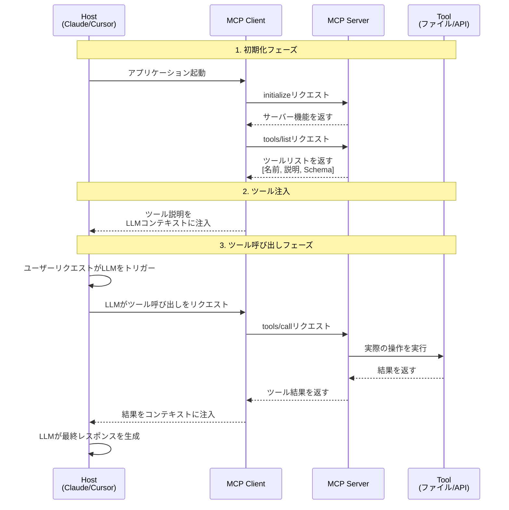
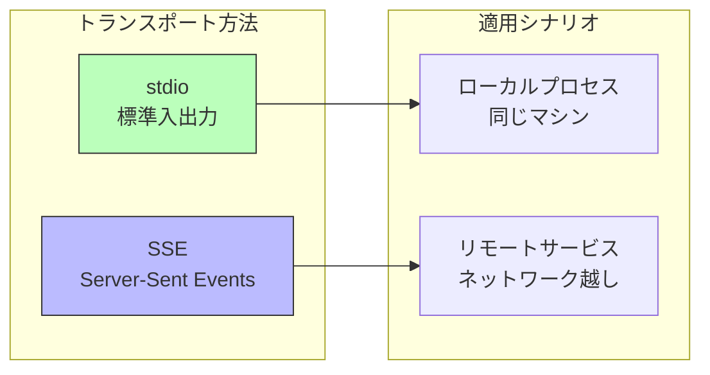
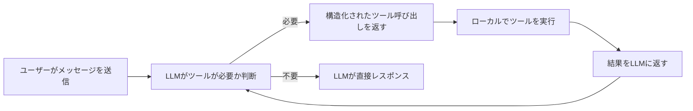

# 第2章:プログラミングエージェントのアーキテクチャ

## コース概要

Agentは、AIプログラミングのコア能力です。基本原理を理解することで、ツールをより良く使用できます。

### 学習目標
- Agentアーキテクチャのコアコンポーネントを理解する
- ツール使用と関数呼び出しメカニズムを習得する
- MCP(Model Context Protocol)プロトコルを学ぶ
- ゼロからシンプルなCoding Agentを構築する

---

## 1. Coding Agentとは?

```
Agent = LLM + ツール + ループ
```

- **LLM** は推論と意思決定を担当
- **ツール** はAgentが世界とインタラクションすることを可能にする
- **ループ** はAgentがタスクを完了するまで継続的に動作することを可能にする

### Agentアーキテクチャのコアステップ

```
1. ユーザー入力を読み取る → 対話に追加
2. LLMに利用可能なツール(Read_file, List_dir, Edit_file, Create_file)を伝える
3. LLMが適切なタイミングでツールの使用をリクエスト
4. ローカルでツールを実行し、結果を返す
5. タスクが完了するまで対話を続ける
```

---

## 2. Agentアーキテクチャの詳細

### 2.1 全体アーキテクチャ

Agentのコアは**感知-思考-行動**の循環システムであり、**ReAct(Reasoning + Acting)**パターンとも呼ばれます。



### 2.2 コアコンポーネントの説明

| コンポーネント | 責任 | 主な特徴 |
|------|------|----------|
| **入力プロセッサ** | ユーザーリクエストを解析し、意図を抽出 | 複数の入力形式をサポート |
| **コンテキストマネージャ** | 対話履歴と状態を管理 | コンテキストウィンドウの最適化 |
| **LLM推論エンジン** | コアの意思決定と推論 | 複数のモデルをサポート |
| **ツールセレクタ** | 意図に基づいて適切なツールを選択 | 動的なツール発見 |
| **ツールセット** | 具体的な操作を実行 | 拡張可能なアーキテクチャ |
| **レスポンス生成** | 最終的な応答を生成 | 複数フォーマットの出力 |

---

## 3. Agent Loopの詳細

### 3.1 Agent Loopワークフロー

Agent Loopは、Agentのコア実行メカニズムであり、Agentがタスクを反復的に処理する方法を決定します。



### 3.2 Agent Loop疑似コード実装

```python
def agent_loop(user_input: str, tools: list[Tool], max_iterations: int = 10):
    """
    Agent メインループ実装
    """
    # 1. コンテキストの初期化
    messages = [
        {"role": "system", "content": SYSTEM_PROMPT},
        {"role": "user", "content": user_input}
    ]

    # 2. ループ開始
    for iteration in range(max_iterations):
        # 3. LLMを呼び出し
        response = llm.chat(
            messages=messages,
            tools=tools,  # LLMに利用可能なツールを伝える
        )

        # 4. ツール呼び出しが必要かチェック
        if response.tool_calls:
            # 5. すべてのツール呼び出しを実行
            for tool_call in response.tool_calls:
                # ツールを実行
                result = execute_tool(tool_call.name, tool_call.args)

                # 結果をメッセージ履歴に追加
                messages.append({
                    "role": "tool",
                    "tool_call_id": tool_call.id,
                    "content": result
                })

            # ループを継続し、LLMにツール結果を処理させる
            continue

        # 6. ツール呼び出しがない場合、完了をチェック
        if is_task_complete(response):
            return response.content

        # 7. そうでなければ対話を続ける
        messages.append({"role": "assistant", "content": response.content})

    return "最大反復回数に到達、タスクが完了していません"
```

### 3.3 主要なループパラメータ

| パラメータ | 説明 | 推奨値 |
|------|------|--------|
| `max_iterations` | 最大反復回数、無限ループを防ぐ | 10-50 |
| `timeout` | 単一のLLM呼び出しのタイムアウト時間 | 30-120秒 |
| `context_window` | コンテキストウィンドウのサイズ | モデルに応じて決定 |
| `retry_count` | エラー再試行回数 | 3 |

---

## 4. ツール呼び出しメカニズムの詳細

### 4.1 ツール呼び出しフロー



### 4.2 ツール定義形式

ツールはJSON Schemaを使用して定義され、名前、説明、パラメータ仕様が含まれます:

```json
{
  "name": "read_file",
  "description": "指定されたパスのファイル内容を読み取る",
  "parameters": {
    "type": "object",
    "properties": {
      "file_path": {
        "type": "string",
        "description": "ファイルの絶対パス"
      },
      "offset": {
        "type": "integer",
        "description": "開始行番号、オプション"
      },
      "limit": {
        "type": "integer",
        "description": "読み取り行数、オプション"
      }
    },
    "required": ["file_path"]
  }
}
```

### 4.3 ツール呼び出しの例

```json
// LLMがツール呼び出しをリクエスト
{
  "tool_calls": [
    {
      "id": "call_abc123",
      "type": "function",
      "function": {
        "name": "read_file",
        "arguments": "{\"file_path\": \"/src/main.py\"}"
      }
    }
  ]
}

// ツール実行結果をLLMに返す
{
  "role": "tool",
  "tool_call_id": "call_abc123",
  "content": "def main():\n    print('Hello, World!')\n"
}
```

### 4.4 複数ツールの協調フロー



---

## 5. メッセージタイプとコンテキスト管理

### 5.1 メッセージタイプ



### 5.2 コンテキストウィンドウ管理戦略

| 戦略 | 説明 | 適用シナリオ |
|------|------|----------|
| **スライディングウィンドウ** | 最近のN件のメッセージを保持 | シンプルな対話 |
| **要約圧縮** | 履歴メッセージを要約に圧縮 | 長い対話 |
| **セマンティック検索** | 関連する履歴メッセージを検索 | 複雑なタスク |
| **優先度キュー** | 重要度に応じてメッセージを保持 | マルチタスクシナリオ |

---

## 6. 用語集

| 用語 | 説明 |
|------|------|
| **System Prompt** | LLMの全体的な動作といくつかの指示を定義 |
| **User Prompt** | ユーザーのカスタムリクエスト |
| **Assistant Prompt** | LLMのレスポンス |
| **Tool Call** | LLMによって開始されたツール呼び出しリクエスト |
| **Tool Result** | ツール実行後に返される結果 |
| **Context Window** | LLMが処理できる最大トークン数 |
| **Agent Loop** | Agentの反復実行ループ |

### Claudeの秘訣

1. **Front-load context** - 小さく正確なプロンプトで事前にコンテキストをロード
2. **System-reminderタグ** - あらゆる場所で<system-reminder>を使用して動作のドリフトを防ぐ
3. **コマンドプレフィックス抽出** - ユーザーコマンドを明確に抽出
4. **サブエージェント(Subagents)** - サブエージェントを生成してコンテキストの過負荷を防ぐ

---

## 7. ツール使用とFunction Calling

### Function Callingの原理

```json
{
  "name": "get_weather",
  "description": "指定された都市の天気情報を取得",
  "parameters": {
    "type": "object",
    "properties": {
      "city": { "type": "string", "description": "都市名" }
    },
    "required": ["city"]
  }
}
```

### よく使用されるツール
- **Read_file** - ファイル内容を読み取る
- **List_dir** - ディレクトリ内容を一覧表示
- **Edit_file** - ファイルを編集
- **Create_file** - 新しいファイルを作成

### ワークフロー

1. ツールの名前、説明、パラメータスキーマを定義
2. LLMはユーザーリクエストに基づいてツールを呼び出すタイミングを決定
3. ツールを実行し、結果をLLMに返す
4. LLMはレスポンスの生成を続けるか、さらにツールをリクエスト

---

## 8. MCP (Model Context Protocol)

### 8.1 なぜMCPが必要なのか?

- LLMは大量だが静的な世界知識を持っており、再トレーニング時にのみ更新される
- 完全に自律的なシステムを構築するには、動的データを入力する堅牢な方法が必要

**動的データの例**:
- 今日の天気は?
- 大統領は誰?
- ビットコインの価格は?
- Nikeの最新広告のナレーターは誰?

RAGとツール呼び出しは現在最良の解決策です。

### 8.2 MCP定義

> Model Context Protocol: システムが一般的な方法でAIモデルにコンテキストを提供できるプロトコル

### 8.3 MCP全体アーキテクチャ



### 8.4 MCP通信フローの詳細



### 8.5 MCPの利点

| 利点 | 説明 |
|------|------|
| **標準化** | 統一されたツール記述形式、JSON-RPCを使用 |
| **拡張可能** | MCP Serverは任意のツールをラップ可能 |
| **統合作業の削減** | M x N → M + N |
| **LSPから継承** | Language Server Protocolsから拡張 |
| **アクティブワークフローのサポート** | 受動的な応答だけでなく、アクティブなエージェントワークフロー |

### 8.6 MCPコアコンポーネント

| コンポーネント | 説明 |
|------|------|
| **Host** | Cursor、Claude Desktopなどのai IDE |
| **MCP Client** | Hostに埋め込まれたライブラリ(各サーバーにステートフルセッション) |
| **MCP Server** | ツールフロントエンドの軽量ラッパー |
| **Tool** | 呼び出し可能な関数(データソース、APIなど) |

### 8.7 MCPツール定義の例

```json
{
  "name": "read_file",
  "description": "ローカルファイルの内容を読み取る",
  "inputSchema": {
    "type": "object",
    "properties": {
      "path": {
        "type": "string",
        "description": "読み取るファイルパス"
      }
    },
    "required": ["path"]
  }
}
```

### 8.8 MCPトランスポート層



### 8.9 MCPの制限事項

- **ツール処理能力の制限**: Agentは大量のツールをうまく処理できない
- **コンテキストウィンドウ消費**: APIはコンテキストウィンドウを急速に消費
- **AI ネイティブ設計**: APIを設計する際にAIの使用方法を考慮する必要がある

---

## 9. ゼロからCoding Agentを構築: 200行のコードの秘密

> このセクションの内容は、Mihail Ericの記事["The Emperor Has No Clothes: How to Code Claude Code in 200 Lines of Code"](https://www.mihaileric.com/The-Emperor-Has-No-Clothes/)に基づいています

### 9.1 コアインサイト

今日のAIプログラミングアシスタントは魔法のように見えます。断片的な英語で要件を説明すると、ファイルを読み取り、プロジェクトを編集し、機能的なコードを書くことができます。

しかし真実は:**これらのツールのコアは魔法ではなく、約200行のシンプルなPythonコードです。**

### 9.2 メンタルモデル

Coding Agentを理解する鍵は、それが本質的には**ツールボックスを持つLLM対話**にすぎないことを認識することです:



**重要なポイント**: LLMはファイルシステムに直接触れません。操作の発生をリクエストするだけで、あなたのコードがそれを実現します。

### 9.3 3つのコアツール

最小限のCoding Agentには、3つのツールだけが必要です:

| ツール | 機能 | 必要性 |
|------|------|--------|
| **read_file** | ファイル内容を読み取る | LLMにコードを見せる |
| **list_files** | ディレクトリ内容を一覧表示 | LLMがプロジェクト構造をナビゲート |
| **edit_file** | ファイルを編集/作成 | LLMがコードを変更 |

本番環境のAgent(Claude Codeなど)にはさらに多くのツール(grep、bash、websearchなど)がありますが、3つのツールで驚くべき仕事ができます。

### 9.4 コード実装

#### 基本セットアップ

```python
import inspect
import json
import os
import anthropic
from dotenv import load_dotenv
from pathlib import Path
from typing import Any, Dict, List, Tuple

load_dotenv()
claude_client = anthropic.Anthropic(api_key=os.environ["ANTHROPIC_API_KEY"])

# ターミナルカラー出力
YOU_COLOR = "\u001b[94m"
ASSISTANT_COLOR = "\u001b[93m"
RESET_COLOR = "\u001b[0m"

def resolve_abs_path(path_str: str) -> Path:
    """相対パスを絶対パスに変換"""
    path = Path(path_str).expanduser()
    if not path.is_absolute():
        path = (Path.cwd() / path).resolve()
    return path
```

#### ツール1: ファイル読み取り

```python
def read_file_tool(filename: str) -> Dict[str, Any]:
    """
    Gets the full content of a file provided by the user.
    :param filename: The name of the file to read.
    :return: The full content of the file.
    """
    full_path = resolve_abs_path(filename)
    with open(str(full_path), "r") as f:
        content = f.read()
    return {
        "file_path": str(full_path),
        "content": content
    }
```

#### ツール2: ファイル一覧

```python
def list_files_tool(path: str) -> Dict[str, Any]:
    """
    Lists the files in a directory provided by the user.
    :param path: The path to a directory to list files from.
    :return: A list of files in the directory.
    """
    full_path = resolve_abs_path(path)
    all_files = []
    for item in full_path.iterdir():
        all_files.append({
            "filename": item.name,
            "type": "file" if item.is_file() else "dir"
        })
    return {
        "path": str(full_path),
        "files": all_files
    }
```

#### ツール3: ファイル編集

```python
def edit_file_tool(path: str, old_str: str, new_str: str) -> Dict[str, Any]:
    """
    Replaces first occurrence of old_str with new_str in file.
    If old_str is empty, create/overwrite file with new_str.
    """
    full_path = resolve_abs_path(path)
    if old_str == "":
        full_path.write_text(new_str, encoding="utf-8")
        return {"path": str(full_path), "action": "created_file"}

    original = full_path.read_text(encoding="utf-8")
    if original.find(old_str) == -1:
        return {"path": str(full_path), "action": "old_str not found"}

    edited = original.replace(old_str, new_str, 1)
    full_path.write_text(edited, encoding="utf-8")
    return {"path": str(full_path), "action": "edited"}
```

#### ツールレジストリ

```python
TOOL_REGISTRY = {
    "read_file": read_file_tool,
    "list_files": list_files_tool,
    "edit_file": edit_file_tool
}
```

#### システムプロンプト

```python
SYSTEM_PROMPT = """
You are a coding assistant whose goal it is to help us solve coding tasks.
You have access to a series of tools you can execute. Here are the tools you can execute:
{tool_list_repr}
When you want to use a tool, reply with exactly one line in the format:
'tool: TOOL_NAME({{JSON_ARGS}})' and nothing else.
Use compact single-line JSON with double quotes. After receiving a tool_result(...)
message, continue the task.
If no tool is needed, respond normally.
"""
```

#### ツール呼び出しの解析

```python
def extract_tool_invocations(text: str) -> List[Tuple[str, Dict[str, Any]]]:
    """
    'tool: name({...})' 形式の行からツール呼び出しを抽出
    """
    invocations = []
    for raw_line in text.splitlines():
        line = raw_line.strip()
        if not line.startswith("tool:"):
            continue
        try:
            after = line[len("tool:"):].strip()
            name, rest = after.split("(", 1)
            name = name.strip()
            if not rest.endswith(")"):
                continue
            json_str = rest[:-1].strip()
            args = json.loads(json_str)
            invocations.append((name, args))
        except Exception:
            continue
    return invocations
```

#### Agentループ

```python
def run_coding_agent_loop():
    conversation = [{
        "role": "system",
        "content": get_full_system_prompt()
    }]

    while True:
        # ユーザー入力を取得
        user_input = input(f"{YOU_COLOR}You:{RESET_COLOR}:")
        conversation.append({
            "role": "user",
            "content": user_input.strip()
        })

        # 内部ループ: ツール呼び出しを処理
        while True:
            assistant_response = execute_llm_call(conversation)
            tool_invocations = extract_tool_invocations(assistant_response)

            if not tool_invocations:
                # ツール呼び出しなし、レスポンスを出力
                print(f"{ASSISTANT_COLOR}Assistant:{RESET_COLOR}: {assistant_response}")
                conversation.append({
                    "role": "assistant",
                    "content": assistant_response
                })
                break

            # すべてのツール呼び出しを実行
            for name, args in tool_invocations:
                tool = TOOL_REGISTRY[name]
                result = tool(**args)
                conversation.append({
                    "role": "user",
                    "content": f"tool_result({json.dumps(result)})"
                })
```

### 9.5 実行例

```
You: hello.py ファイルを作成し、hello worldを実装

Agent呼び出し: edit_file(path="hello.py", old_str="", new_str="print('Hello World')")
完了！hello.pyを作成し、hello worldを実装しました。

You: hello.pyを編集し、2つの数を掛け算する関数を追加

Agent呼び出し: read_file(filename="hello.py")  # 現在の内容を確認
Agent呼び出し: edit_file(path="hello.py", old_str="...", new_str="...")

Assistant: hello.pyにmultiply関数を追加しました。
```

### 9.6 本番ツールとの比較

| 特性 | 私たちの実装 | Claude Codeなどの本番ツール |
|------|-----------|----------------------|
| コアループ | ✓ 同じ | ✓ 同じ |
| エラー処理 | 基本 | 完璧 |
| レスポンスストリーミング | ✗ | ✓ |
| コンテキスト管理 | 基本 | 高度(長いファイルの要約など) |
| ツール数 | 3個 | より多く(bash、grep、websearchなど) |
| 承認ワークフロー | ✗ | ✓(破壊的操作には確認が必要) |
| コード行数 | ~200行 | 数千行 |

**コア結論**: 本番ツールは多くのエンジニアリング詳細を追加していますが、コアアーキテクチャは私たちが実装したこのループです — LLMが何をするか決定し、コードがそれを実行し、結果が戻ってきます。これが全体のアーキテクチャです。

### 9.7 重要な学習ポイント

1. **ツールの説明が重要**: 関数のdocstringは、LLMにツールの使用方法を伝えるために直接使用されます
2. **構造化された戻り値**: ツールは辞書を返し、LLMは構造化されたコンテキストが必要です
3. **設定より規約**: \`old_str=""\`は新しいファイルの作成を意味する
4. **ループがすべて**: 外側のループはユーザー入力を取得し、内側のループはツール呼び出しチェーンを処理します

---

## 10. 実践演習

### 演習1: Agentループの理解
ClaudeまたはCursorでAgentがどのように動作するかを観察:
1. ユーザーリクエストを受信
2. どのツールを使用するか決定
3. ツールを実行し、結果を処理
4. タスクが完了するまで継続

### 演習2: MCPの探索
1. CursorまたはClaude Desktopで利用可能なMCPを確認
2. 新しいMCP Serverの追加を試す
3. ツールがLLMにどのように説明されるかを観察

### 演習3: シンプルなAgentの構築
ゼロからシンプルなCoding Agentを構築してみる:
1. LLM APIをセットアップ
2. 利用可能なツールを定義
3. agentループを実装
4. 基本機能をテスト

### 演習4: Agent機能の拡張
第9節のコードに基づいて、以下の機能を追加してみる:
1. \`grep_search\`ツールを追加してコード内容を検索
2. \`run_bash\`ツールを追加してコマンドを実行
3. ストリーミング出力を実装
4. 操作確認メカニズムを追加

---

## 講義資料

### Lecture 3: Building a coding agent from scratch
- [Slides (PDF)](../slides/week2-lecture1-coding-agent-scratch.pdf)

### Lecture 4: Building a custom MCP server
- [Slides (PDF)](../slides/week2-lecture2-mcp-server.pdf)

---

## 参考資料

1. **[The Emperor Has No Clothes: How to Code Claude Code in 200 Lines of Code](https://www.mihaileric.com/The-Emperor-Has-No-Clothes/)** - Mihail Eric
2. **[MCP Introduction](https://stytch.com/blog/model-context-protocol-introduction/)**
3. **[Sample MCP Server Implementations](https://github.com/modelcontextprotocol/servers)**

---

## 課題

**[Chapter 2 Assignment](https://github.com/mihail911/modern-software-dev-assignments/tree/master/week2)**

AI IDEで開発タスクを完了してください。

---

## 次の章

[次の章: Chapter 3](./chapter3.md)

---
