# 第3章:AI統合開発環境

## 講義概要

AI IDEの本質は代替ではなく拡張である。コンテキストの品質が出力の品質を決定する。

### 学習目標
- AI IDEの動作原理を理解する
- AI IDEのベストプラクティスを習得する
- 同期ツールと非同期ツールの使用シーンを学ぶ
- 2025年のプログラミングワークフローを理解する

---

## 1. なぜIDEなのか?

### 1.1 IDEの定義

**IDE (Integrated Development Environment)** はソフトウェア開発のための統合ワークスペースであり、以下を含む:
- コードエディタ
- コンパイラ
- デバッガ
- その他の開発ツール

### 1.2 なぜAI拡張IDEが自然な進化なのか


### 1.3 IDE進化の中核的緊張関係

IDEの進化には常に緊張関係が存在する:

| 方向 | 説明 |
|------|------|
| **機能統合** | より多くの機能を1つのツールに統合 |
| **開発者カスタマイズ** | 開発者がツールを自由に選択・設定できる |

---

## 2. AI IDE発展の歴史

### 2.1 タイムライン

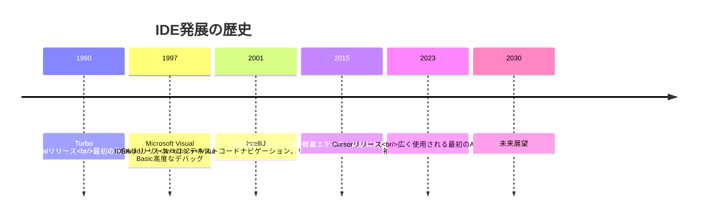

### 2.2 重要なマイルストーン

| 年 | 製品 | コアイノベーション |
|------|------|----------|
| 1980 | Turbo Pascal | 最初の真のIDE、編集・コンパイル・デバッグを統合 |
| 1997 | Visual Studio | C++/Visual Basic向け高度なデバッグ機能 |
| 2001 | IntelliJ IDEA | コンテキストコードナビゲーション、リファクタリング、インテリジェント補完 |
| 2015 | VSCode | 軽量 + 高度に拡張可能なエコシステム |
| 2023 | Cursor | 広く使用される最初のAIネイティブIDE |

---

## 3. AI IDEの2つのモード

### 3.1 基本モード (Bread-and-butter Modes)

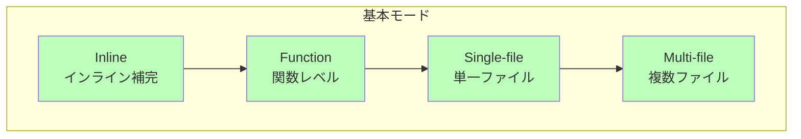

| モード | 説明 | 典型的なシーン |
|------|------|----------|
| **Inline** | インラインコード補完 | 単一行コードの迅速な完成 |
| **Function** | 関数レベルの生成 | 関数全体の実装を生成 |
| **Single-file** | 単一ファイル操作 | 単一ファイルのリファクタリング |
| **Multi-file** | 複数ファイル操作 | ファイル間のリファクタリングと修正 |

### 3.2 AIネイティブモード (True AI-native)

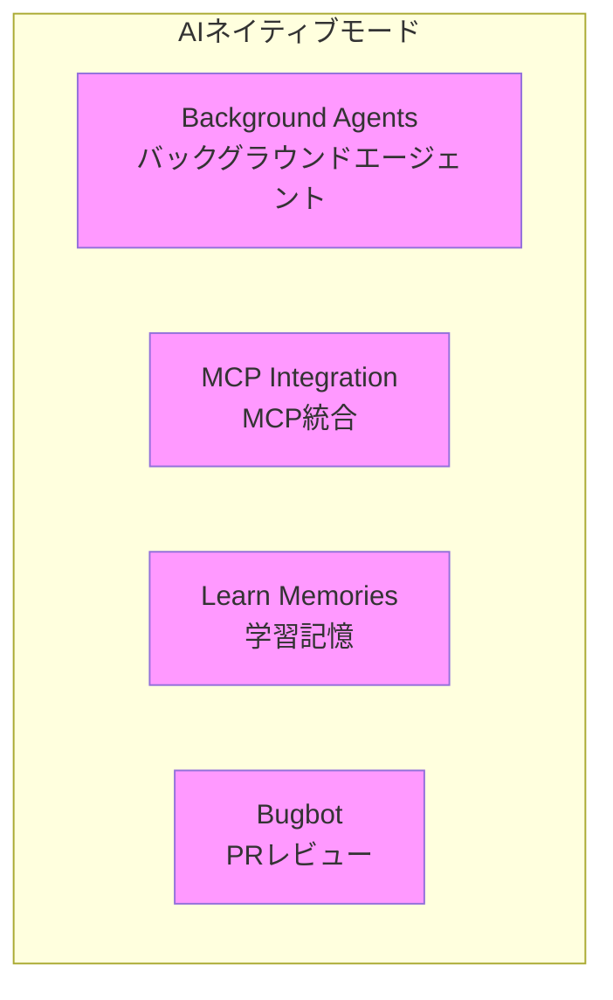

| 機能 | 説明 |
|------|------|
| **Background Agents** | バックグラウンドで実行されるAIエージェント、複数タスクを並列処理可能 |
| **MCP Integration** | MCPプロトコルを統合し、ツール能力を拡張 |
| **Learn Memories** | プロジェクト固有のコンテキストをAIが学習・記憶 |
| **Bugbot** | 自動PRレビュー、潜在的な問題を発見 |

---

## 4. AI IDEの動作原理

### 4.1 Tab Complete(コード補完)

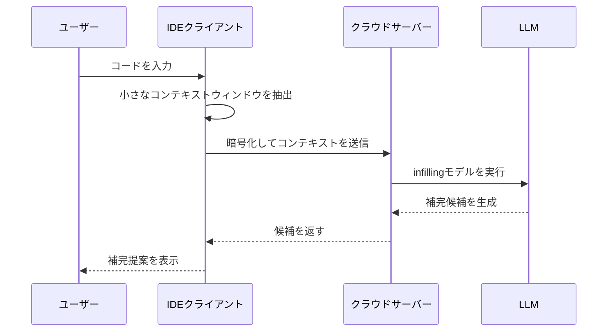

**ワークフロー:**
1. 現在のコード周辺の小さなコンテキストウィンドウが暗号化される
2. サーバーが受信してinfilling LLMを実行
3. 提案が返されユーザーに表示される

### 4.2 Chat(対話モード)

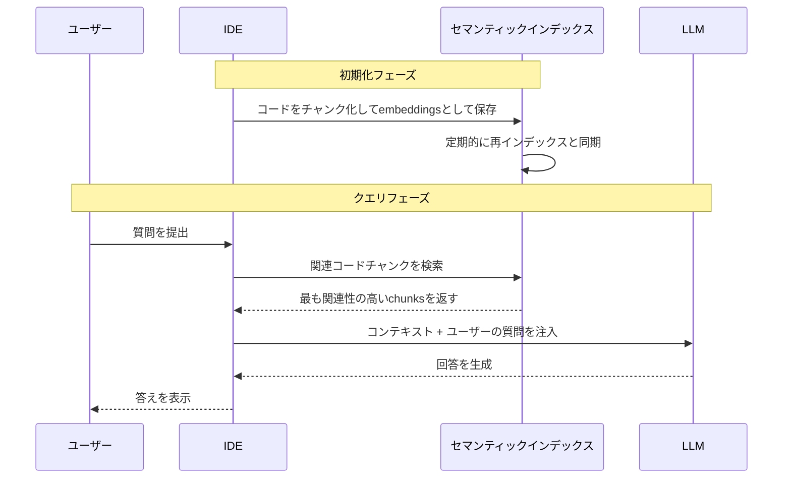

**主要技術:**

| 技術 | 説明 |
|------|------|
| **コードチャンク化** | コードをセマンティック単位に分割して保存 |
| **Embeddings** | コードチャンクのベクトル表現、セマンティック検索をサポート |
| **セマンティックインデックス** | あいまい検索をサポートするインデックス構造 |
| **Merkle Trees** | コード差分の効率的な計算に使用、同期を最適化 |
| **ファイル名難読化** | プライバシー保護、実際のファイル名を露出しない |

### 4.3 Context Management(コンテキスト管理)

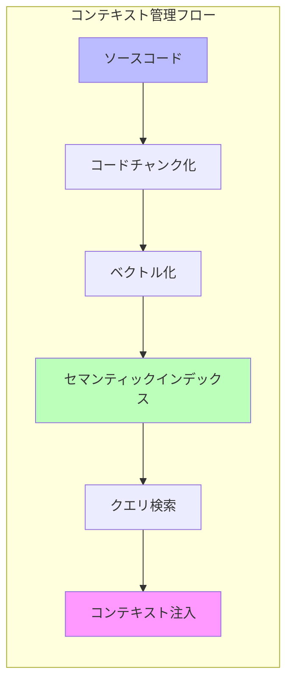

---

## 5. 同期 vs 非同期ツール

### 5.1 AIプログラミングツールの3つの時代

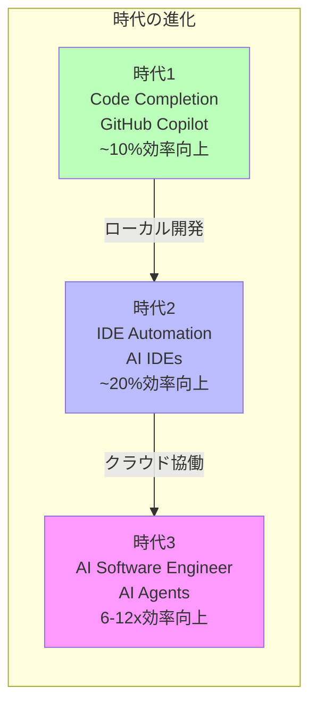

| 時代 | ツールタイプ | 代表製品 | 効率向上 | 特徴 |
|------|----------|----------|----------|------|
| 1 | Code Completion | GitHub Copilot | ~10% | コード補完、ローカル開発 |
| 2 | IDE Automation | Cursor, Windsurf | ~20% | 単一タスク完成、ローカル同期 |
| 3 | AI Software Engineer | Devin | 6-12x | マルチタスク並列、クラウド非同期 |

### 5.2 同期 (Synchronous) モード

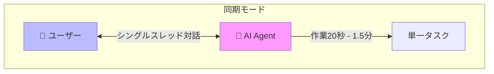

**特徴:**
- **シングルスレッド**: 一度に1つのタスクのみ処理
- **人間がループ内**: 人間が継続的に意思決定に参加
- **注意力集中**: 1つのタスクに専念
- **AI作業時間**: 20秒 - 1.5分
- **フロー状態を維持**

**ローカルツール**: Windsurf, Cursor

### 5.3 非同期 (Asynchronous) モード

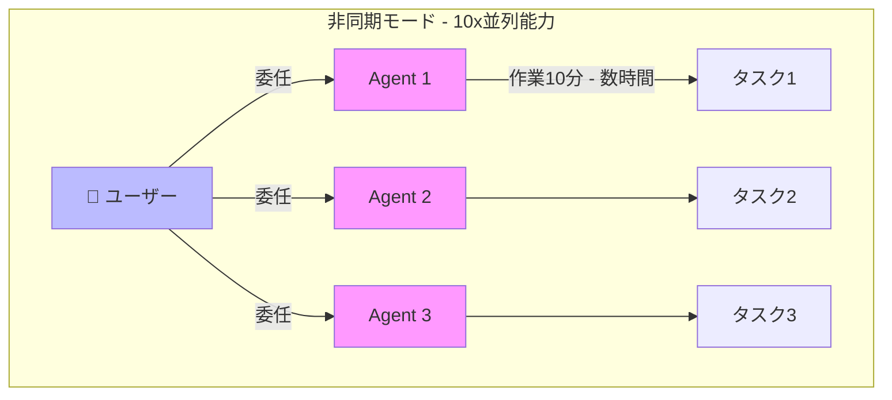

**特徴:**
- **マルチスレッド**: 複数タスクを同時処理
- **人間の委任**: 人間がタスクを割り当てた後、注意を切り替え
- **注意力切替**: 複数タスク間で流動
- **AI作業時間**: 10分 - 数時間
- **10x並列能力**

**クラウドツール**: Devin, DeepWiki, Codemaps

### 5.4 ローカル vs クラウド比較

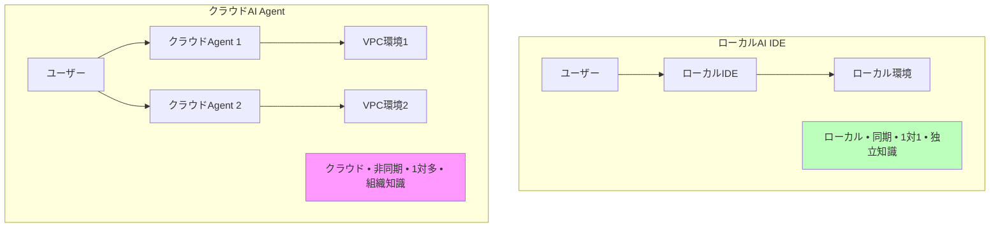

| 次元 | ローカルAI IDE | クラウドAI Agent |
|------|-------------|---------------|
| 場所 | ローカル | クラウドVPC |
| モード | 同期 | 非同期 |
| 関係 | 1対1 | 1対多 |
| 知識 | 独立/隔離 | 組織レベル共有 |
| 用途 | 個人速度向上 | 無限並列能力 |

### 5.5 半非同期の罠

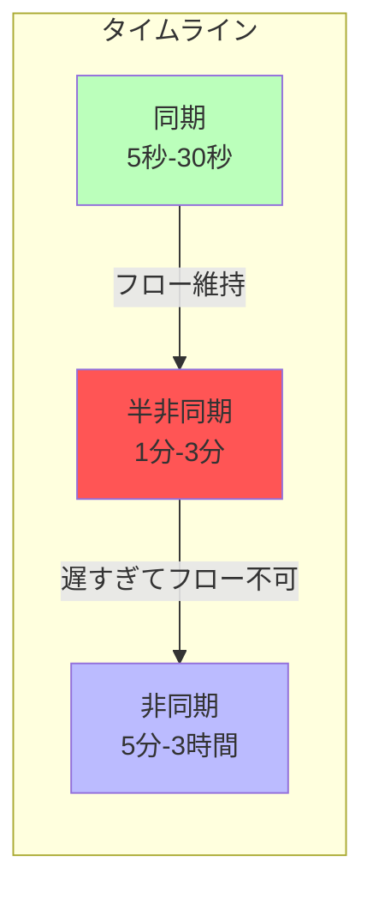

**半非同期の問題:**
- **遅すぎる**: フロー状態を維持できない
- **短すぎる**: マルチタスク切替ができない
- **推奨**: 回避すべき! 同期に高速化するか非同期に拡張するか

### 5.6 非同期エージェント使用の課題

> "Managing async agents can unlock 10x gains… but most people use sync agents."

**なぜほとんどの人が同期ツールを使うのか?**

1. **管理は難しいスキル** - 人に対してもエージェントに対しても
2. **マルチタスク切替が必要** - 異なるコンテキスト間で迅速に切替
3. **新しいコンテキストを迅速に理解する必要** - 新しいタスク背景を素早く把握

---

## 6. 2025プログラミングワークフロー

### 6.1 ワークフロー概要

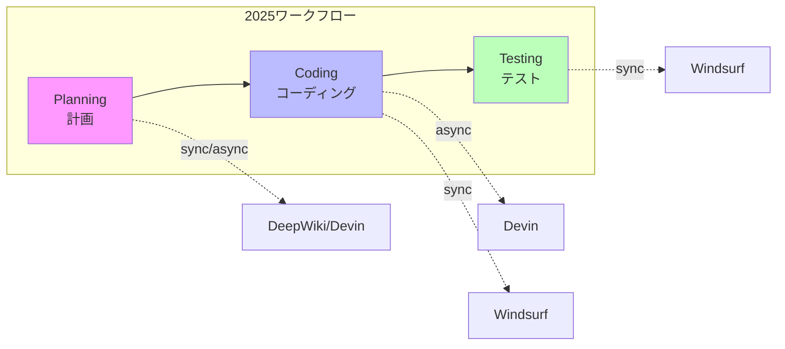

### 6.2 計画フェーズ (Planning)

**推奨ツール:**
- DeepWiki - コードベース理解とドキュメント
- Ask Devin - AI計画提案を取得
- Codemaps - コード構造マッピング
- DeepWiki in Windsurf - ローカルコード理解

### 6.3 コーディングフェーズ (Coding)

**非同期委任:**
```
1. タスクをDevinに委任 (async)
2. AIエージェントが独立してコーディング作業を完了
3. 人間は他のタスクを処理可能
```

### 6.4 テストフェーズ (Testing)

**一般的なワークフロー:**
```
1. タスクをDevinに委任 (async)
2. Windsurfでテストと反復修正 (sync)
```

**将来の展望:**
> 非同期エージェントが自律的にテストできるようになれば、レバレッジ効果はさらに増加する。これは徐々に現実になりつつある。

### 6.5 将来の進化

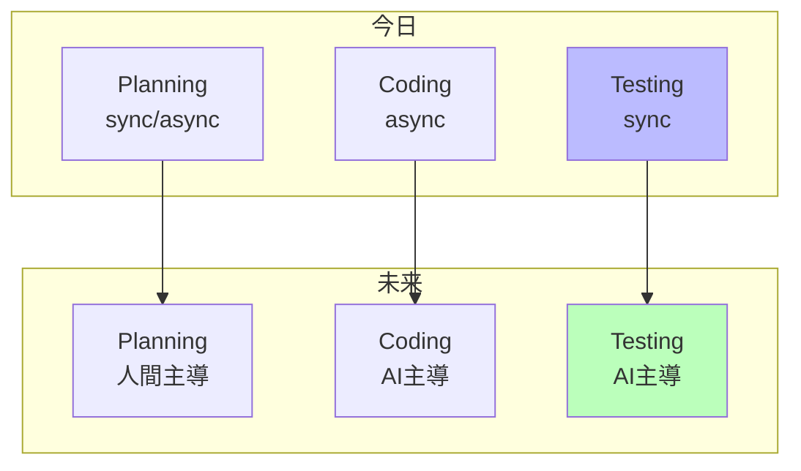

---

## 7. ベストプラクティス

### 7.1 効果的なタスク記述の作成

簡単な修正には過度に詳細なプロンプトは不要。しかし複雑なタスクには、**プロダクトマネージャー**として詳細な仕様書を書く必要がある。

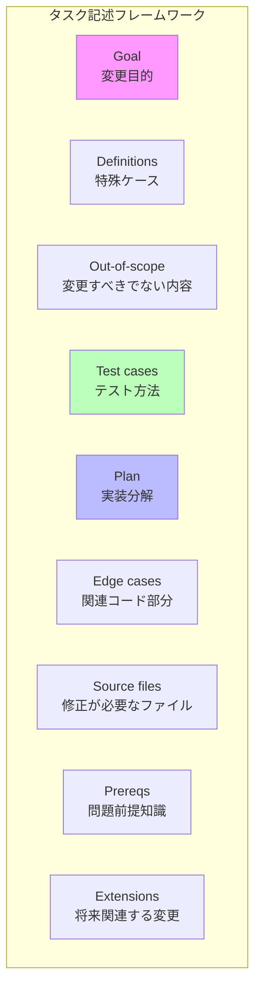

| 要素 | 質問 | 説明 |
|------|------|------|
| **Goal** | 変更の目的は何か? | 明確な目標声明 |
| **Definitions** | どのような特殊ケースを考慮すべきか? | 境界条件と定義 |
| **Out-of-scope** | 何を変更*すべきでない*か? | 明確なスコープ制限 |
| **Test cases** | どのようにテストするか? | テスト戦略と方法 |
| **Plan** | 高レベル実装分解 | 実装ステップ概要 |
| **Edge cases** | コードベースの関連部分とその理由 | 注意すべき境界ケース |
| **Source files** | 変更が必要なソースファイル | 具体的なファイルリスト |
| **Prereqs** | LLMが知るべき問題前提 | 背景知識説明 |
| **Extensions** | 将来関連する可能性のある変更 | 将来の設計考慮事項 |

### 7.2 コードベースの最適化

> "Optimize your codebase so that a human and an agent could understand what's going on"

**LLMが混乱する主な原因**: 混沌としたリポジトリをコンテキストとしてタスクを完了しようとすること。

**最適化の次元:**

| 次元 | 内容 |
|------|------|
| **記述性** | リポジトリ方向、ファイル構造 |
| **実行可能性** | セットアップと環境設定 |
| **一貫性** | ベストプラクティス、コードスタイル |
| **アクセス性** | アクセスパターン、APIと契約 |

**ヒント**: リポジトリでmonorepo設計を使用することを強く推奨。

### 7.3 ナビゲーションファイル設定

LLMがコードベースをナビゲートするのを助ける設定ファイル:

| ファイル | 用途 | サンプル内容 |
|------|------|----------|
| **CLAUDE.md** | Claudeが自動ロードするコンテキストファイル | 一般的なコマンド、コアファイル、コードスタイル、テスト説明 |
| **cursorrules** | Cursorのルール設定 | プロジェクト固有のルールと設定 |
| **AGENTS.md** | オープンフォーマットのエージェント指示 | 汎用エージェントガイダンス |
| **llms.txt** | LLMがWebページをクロールするためのナビゲーションガイダンスを提供 | Webアクセス可能なプロジェクトドキュメント |

**CLAUDE.mdサンプル:**

```markdown
# Project Overview
Brief description of the project

## Common Commands
- `npm run dev`: Start development server
- `npm test`: Run tests
- `npm run build`: Build for production

## Core Files
- `src/index.ts`: Entry point
- `src/api/`: API handlers
- `src/utils/`: Utility functions

## Code Style
- Use TypeScript
- Follow ESLint rules
- Write tests for new features

## Testing
- Run `npm test` before committing
- Add tests for bug fixes
```

**注意**: エージェントは常にこれらの記述/指示に従うわけではなく、参考用のみ。

---

## 8. 将来の展望

### 8.1 人間エンジニアの新しい役割

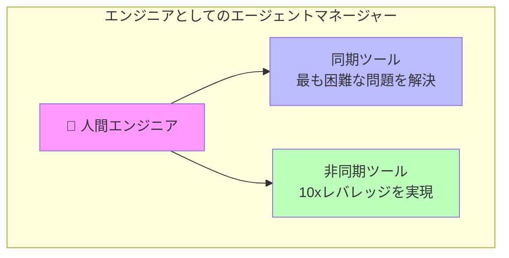

**人間エンジニアはエージェントマネージャーになる:**
1. 同期ツールを活用して最も困難な問題を解決
2. 非同期ツールを活用して10xレバレッジ効果を実現

### 8.2 将来必須のスキル

| スキル | 説明 |
|------|------|
| **委任とマルチスレッド** | 複数エージェントに効果的にタスクを割り当て |
| **コード読解** | AI生成コードを迅速に理解・レビュー |
| **計画、スコープ定義、アーキテクチャ** | 高レベルの設計と意思決定能力 |

---

## 9. 実践演習

### 演習1: CLAUDE.mdの設定
CLAUDE.mdファイルを作成し、以下を含める:
- プロジェクト概要
- 一般的なコマンド
- コードスタイルガイド
- テスト説明

### 演習2: 同期/非同期ツールの試用
1. Windsurfで同期コーディングを実施
2. Devinで非同期タスクを実施
3. 両者の使用体験を比較
4. 複数の非同期タスク間の切替を練習

### 演習3: AI IDE機能の探索
1. Tab Completeを試す
2. Chatモードを試す
3. MCP統合を探索
4. Background Agentsをテスト

### 演習4: タスク記述の作成
中程度の複雑さのタスクについて、9つの要素をすべて含む詳細なタスク記述を作成する。

---

## 講義資料

### Lecture 5: The AI IDE: Fundamentals to Power User
- [Slides (PDF)](../slides/week3-lecture1-ide-setup.pdf)
- **Guest Speaker**: Silas Alberti, Cognition(Head of Research)
- **日付**: 10/10/25, 8:30am PT, 420-041

### Lecture 6: IDE ❤ Agents - An opinionated guide to AI coding in 2025
- [Slides (PDF)](../slides/week3-lecture2-cognition.pdf)
- **Guest Speaker**: Silas Alberti, Founding Team @ Cognition
- **コア内容**: 同期 vs 非同期ツール、2025プログラミングワークフロー、将来スキル

---

## 参考資料

1. **[Claude Code文書](https://docs.anthropic.com/en/docs/claude-code)**
2. **[Cursor文書](https://cursor.sh/docs)**
3. **[Devin文書](https://docs.devin.ai)**

---

## 課題

**[Chapter 3 Assignment](https://github.com/mihail911/modern-software-dev-assignments/tree/master/week3)**

AI IDE環境に習熟し、ベストプラクティスを習得する。

---

## 次の章

[次の章:Chapter 4](./chapter4.md)

---
