# 第4章:プログラミングインテリジェントエージェントパターン

## 授業概要

開発者は「実行」から「管理」へと変化しています。Subagentsは未来のトレンドです:エージェントがエージェントを管理します。

### 学習目標
- エージェント管理の設計パターンを理解する
- Claude Codeの使用テクニックをマスターする
- Hooks、Commands、Subagentsの使用方法を学ぶ
- Anthropicの内部実践経験を理解する

---

## 1. 開発の進化トレンド

### 1.1 開発役割の進化

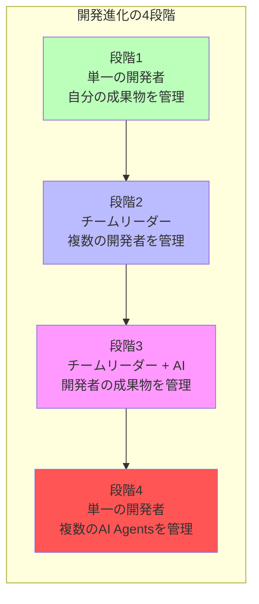

| 段階 | 役割 | 説明 |
|------|------|------|
| 1 | 独立開発者 | 単一の開発者が単一の開発者の成果物を管理 |
| 2 | チームリーダー | リーダーが複数の開発者の成果物を管理 |
| 3 | AI支援チーム | リーダーが複数の開発者の成果物を管理(AIシステムの支援あり) |
| 4 | エージェント管理者 | 単一の開発者が複数のAIエージェントの作業を管理 |

### 1.2 ソフトウェアチームの歴史

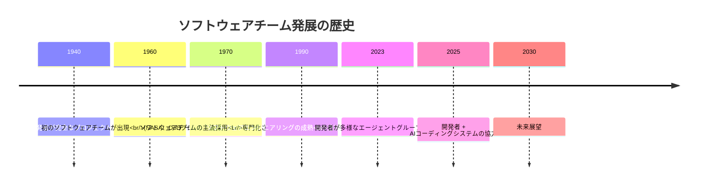

| 年度 | マイルストーン | 象徴的な変化 |
|------|--------|------------|
| 1940 | 独立開発者 | 1人が完全なプロジェクトを処理 |
| 1960 | 初のソフトウェアチーム | NASA、DoDプロジェクトの需要が推進 |
| 1970 | 主流採用 | 専門化された役割が出現 |
| 1990 | エンジニアリングの成熟 | 方法論とツールの標準化 |
| 2023 | エージェントグループ管理 | 開発者が多様なエージェントを管理 |
| 2025 | AI協力 | 開発者 + AIコーディングシステム |
| 2030 | 未来展望 | エージェントがエージェントを管理 |

---

## 2. プログラミング生産性の指数関数的成長

### 2.1 プログラミング言語の生産性の進化

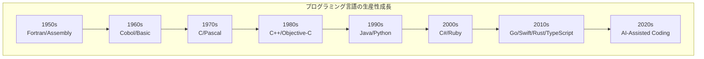

**重要な洞察**:プログラミング言語の生産性はAIによって推進され、指数関数的に成長しています。

### 2.2 IDEの生産性の進化

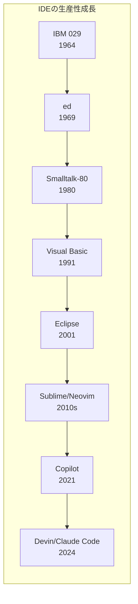

**重要な洞察**:IDEの生産性も同様の指数関数的成長を示し、同じくAIによって推進されています。

### 2.3 検証方法の進化

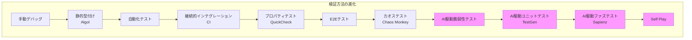

---

## 3. ソフトウェアタスクのステップと責任分担

### 3.1 タスクステップの概要

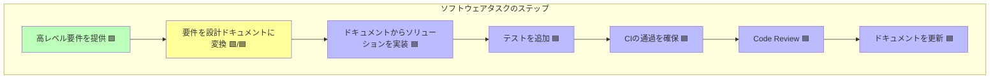

### 3.2 責任分担の凡例

| 色 | 意味 | 実行者 |
|------|------|--------|
| 🟩 緑色 | 人間主導 | 開発者 |
| 🟩/🟦 黄色 | 協力完成 | 開発者 + エージェント |
| 🟦 青色 | エージェント主導 | AIエージェント |

---

## 4. エージェント管理テクニック

### 4.1 4つの核心技術

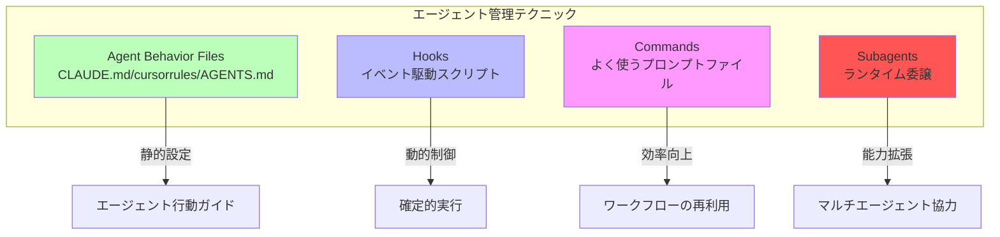

### 4.2 Hooks(フック)

> **定義**:事前定義されたイベントタイプで実行される確定的スクリプト

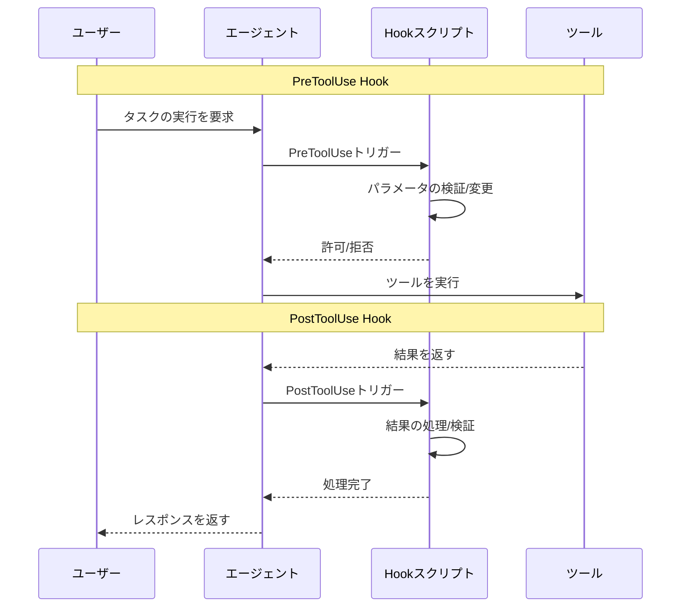

**Hookのタイプ:**

| Hookタイプ | トリガータイミング | 典型的な用途 |
|-----------|----------|----------|
| `PreToolUse` | ツール使用前 | パラメータの検証、制約の追加 |
| `PostToolUse` | ツール使用後 | 結果の検証、ログ記録 |
| `UserPromptSubmit` | ユーザーがプロンプトを送信時 | 入力の前処理 |
| `PreCompact` | コンテキスト圧縮前 | 重要な情報を保持 |
| `...` | その他のタイプ | 継続的に拡張 |

### 4.3 Commands(コマンド)

> **定義**:よく使うプロンプトをファイルとして保存し、エージェントが実行

**使用シナリオ:**

| シナリオ | 説明 |
|------|------|
| テストの実行 | 自動化テストフロー |
| コードレビュー | 標準化されたレビューフロー |
| Git操作 | コミット、プッシュの標準化 |
| デプロイフロー | 自動化されたデプロイステップ |

**利点:**
- 高頻度ワークフローの再利用
- チームの標準化
- 繰り返し入力の削減

### 4.4 Subagents(サブエージェント)

> **定義**:ランタイム委譲、独立した開発者の役割を作成

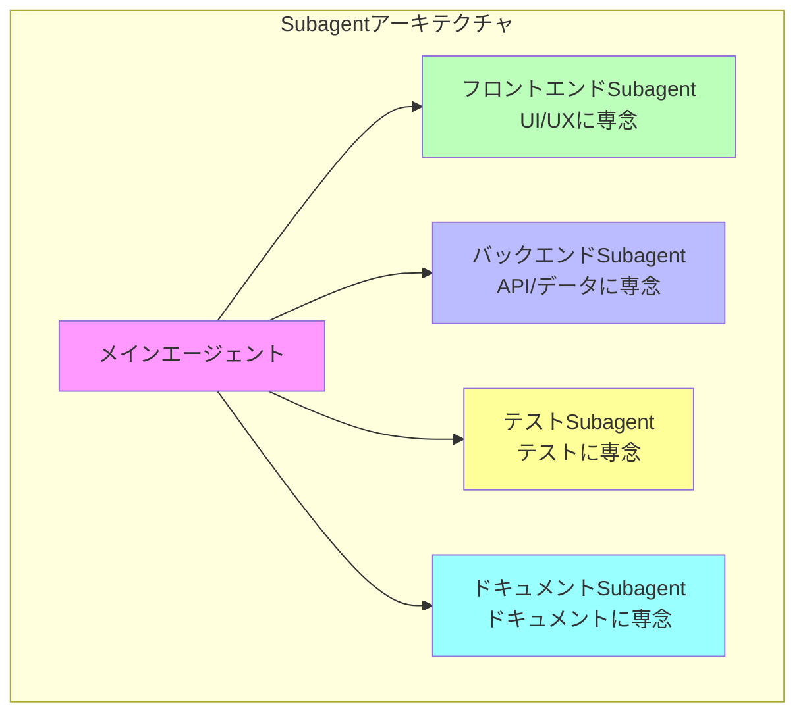

**Subagentの目的:**

1. **異なる開発者の役割を作成**
   - フロントエンド専門家
   - バックエンド専門家
   - テスト専門家
   - ドキュメント専門家

2. **コンテキストの明確な分離**
   - 独立したワークフローコンテキスト
   - コンテキストの汚染を回避

3. **カスタマイズ機能を提供**
   - カスタムシステムプロンプト
   - 専用ツールセット
   - 独立したコンテキストウィンドウ

4. **エージェントがエージェントを管理する方向へ**
   - 階層的管理
   - 専門化された分業

**参考リソース:**
- [Awesome Claude Agents](https://github.com/vijaythecoder/awesome-claude-agents)
- [SuperClaude Framework](https://github.com/SuperClaude-Org/SuperClaude_Framework)

### 4.5 Agent Behavior Files

| ファイル | ツール | 用途 |
|------|------|------|
| `CLAUDE.md` | Claude Code | Claudeが自動的にロードするコンテキスト |
| `cursorrules` | Cursor | Cursorのルール設定 |
| `AGENTS.md` | 汎用 | オープンフォーマットのエージェント指示 |

---

## 5. Claude Code詳細ガイド

### 5.1 Claude Codeの方法論

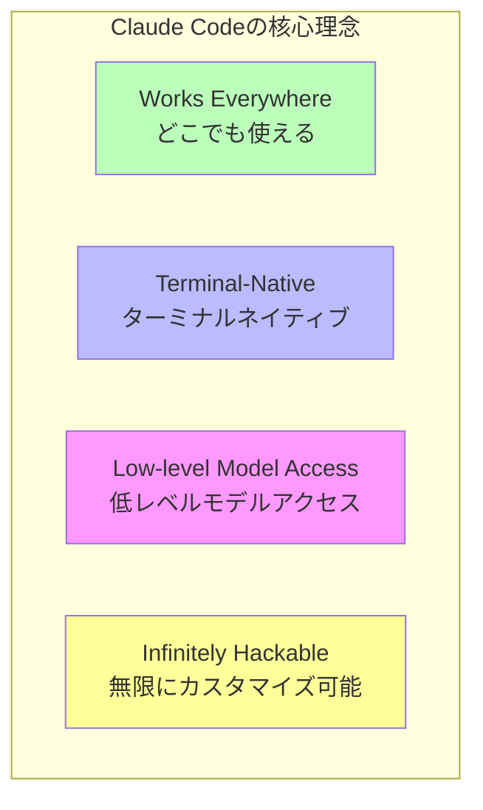

### 5.2 SDLC全体をカバー

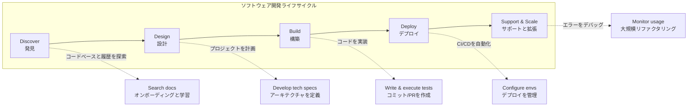

**チームのCLIツールを使用**:git、docker、bqなど、ソリューションに集中し、構文ではありません。

### 5.3 複数のインターフェース

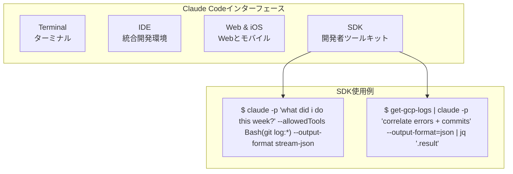

### 5.4 インストール

```bash
npm install -g @anthropic-ai/claude-code
```

### 5.5 核心使用シナリオ

#### シナリオ1:コードベースQ&A + リサーチ

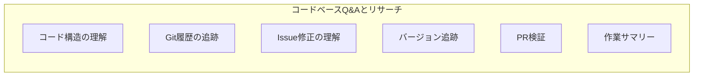

**質問例:**
```
> how do I make a new @app/services/ValidationTemplateFactory?
> why does recoverFromException take so many arguments? look through git history to answer
> why did we fix issue #18363 by adding the if/else in @src/login.ts api?
> in which version did we release the new @api/ext/PreHooks.php api?
> look at PR #9383, then carefully verify which app versions were impacted
> what did I ship last week?
```

#### シナリオ2:コードを書く

| モード | 説明 |
|------|------|
| **1-shot** | 1回で完成、シンプルなタスクに適している |
| **Sidekick** | アシスタントモード、人間とマシンの協力 |
| **Prototype** | 高速プロトタイプ、反復最適化 |

#### シナリオ3:ツールとMCPの統合

```bash
# MCP Serverを追加
$ claude mcp add barley_server -- node myserver

# MCPを使用
> use the barley mcp server to check for error logs
```

#### シナリオ4:パワーオートメーション

複雑なワークフローを自動化し、繰り返し作業を削減します。

### 5.6 タスクにワークフローを適応

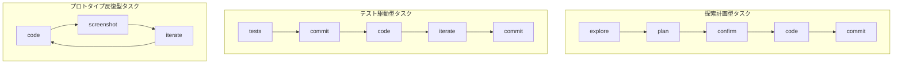

**ワークフロー例:**

**探索計画型:**
```
> figure out the root cause for issue #983, then propose a few fixes.
  Let me choose an approach before you code. ultrathink
```

**テスト駆動型:**
```
> write tests for @utils/markdown.ts to make sure links render properly
  (note the tests won't pass yet, since links aren't yet implemented).
  then commit. then update the code to make the tests pass.
```

**プロトタイプ反復型:**
```
> implement [mock.png]. Then screenshot it with puppeteer and iterate
  till it looks like the mock.
```

### 5.7 プロトタイプ反復の例

Claude CodeがUIデザインを迅速に反復する方法を示します:

```
> make it so instead of todos showing up as they come in, we hide the
  tool use and result for todos, and render a fixed todo list above
  the input. title it "/todo (1 of 3)" in grey

> actually don't show a todo list at all, and instead render the tool
  uses inline, as bold headings when the model starts working on a todo

> also add a todo pill under the text input, similar to bg tasks

> actually undo both the pill and headings. instead, make the todo list
  render to the right of the input, vertically centered with a grey divider

> instead of showing todos above the input, merge them into the spinner.
  show the current todo as the spinner message in active verb form
```

---

## 6. ベストプラクティス

### 6.1 保護措置

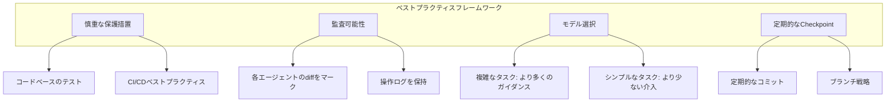

### 6.2 核心原則

| 原則 | 説明 |
|------|------|
| **保護措置** | テスト、CI/CD、セキュリティチェック |
| **監査可能性** | 各エージェントのdiffをマーク、ログを保持 |
| **モデル選択** | 異なるタスクに異なるモデルを使用 |
| **定期的なCheckpoint** | 頻繁なコミット、ロールバックが容易 |

### 6.3 オープンな課題

1. **リサーチ段階の自動化**
   > どのタスクでも最初の10-20%のリサーチ段階を自動化する方法は?

2. **タスクキュー管理**
   > 保留中のタスクキューをどのように維持するか(1回限りの変更の方が簡単)?

---

## 7. Anthropic内部実践事例

> **How Anthropic Uses Claude Code**の読み物に基づく

### 7.1 各チームのClaude Code適用シナリオ

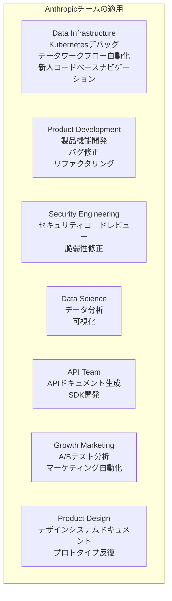

| チーム | 適用シナリオ |
|------|----------|
| **Data Infrastructure** | Kubernetesデバッグ、データワークフロー自動化、新人コードベースナビゲーション |
| **Product Development** | 製品機能開発、バグ修正、リファクタリング |
| **Security Engineering** | セキュリティコードレビュー、脆弱性修正 |
| **Data Science** | データ分析、可視化 |
| **API Team** | APIドキュメント生成、SDK開発 |
| **Growth Marketing** | A/Bテスト分析、マーケティング自動化 |
| **Product Design** | デザインシステムドキュメント、プロトタイプ反復 |

### 7.2 ベストプラクティスのポイント(Anthropicチームより)

1. **詳細なCLAUDE.mdファイル** - より詳細なドキュメントほど、Claude Codeのパフォーマンスが向上
2. **MCPサーバーを使用** - Claude Codeの能力を拡張
3. **スクリーンショット補助** - スクリーンショットで期待するインターフェースを示す
4. **インクリメンタル開発** - 一度に1つのステップを実装
5. **セッション終了時のドキュメント** - 完了した作業をまとめ、ワークフローを改善

---

## 8. 重要な教訓

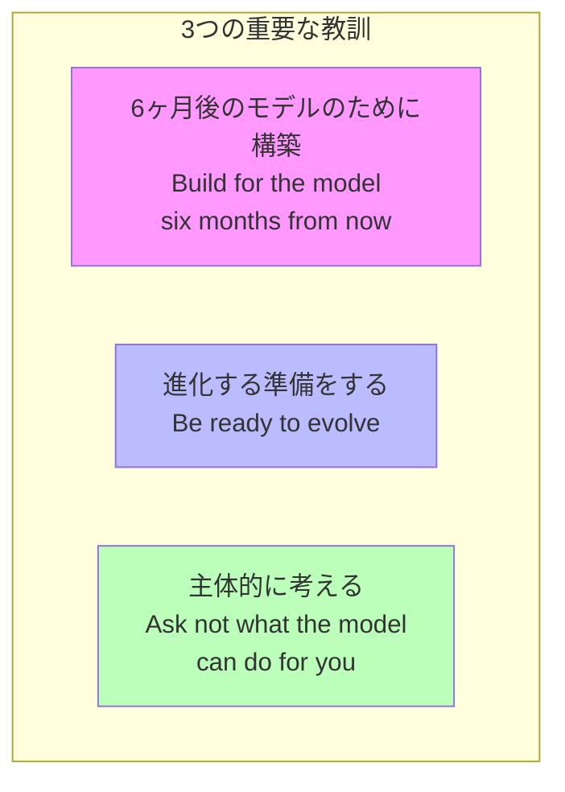

### 8.1 核心的な洞察

1. **Build for the model six months from now**
   - モデルの能力は急速に向上
   - 今日の設計は未来の能力を考慮する必要がある

2. **Be ready to evolve**
   - ツールと方法論は急速に変化
   - 学習と適応能力を維持

3. **Ask not what the model can do for you**
   - モデルにより良いコンテキストを提供する方法を考える
   - ワークフローを主体的に最適化

### 8.2 生産性のトレンド

- **プログラミング言語の生産性**:指数関数的に成長中(AI駆動)
- **IDEの生産性**:同様の指数関数的成長を示す
- **検証方法**:AI駆動のテストが主流になりつつある

---

## 9. 実践演習

### 演習1: CLAUDE.mdの設定
プロジェクトのCLAUDE.mdを作成し、以下を含める:
- プロジェクト概要
- よく使うコマンド
- コードスタイル
- テスト説明

### 演習2: Claude Codeを使用
1. Claude Codeをインストール
2. コードベースを探索
3. コードを書いてみる
4. 異なるワークフローモードを実践

### 演習3: MCPを追加
MCP Serverを追加してみる、例:
```bash
claude mcp add barley_server -- node myserver
```

### 演習4: Hooksの設定
PreToolUse hookを作成し、ファイル変更前に検証を行う。

### 演習5: Subagentsを使用
異なるタスクのために専用のsubagent設定を作成してみる。

---

## 講義資料

### Lecture 7: How to be an Agent Manager
- [Slides (PDF)](../slides/week4-lecture1-agent-manager.pdf)
- **ゲストスピーカー**: Boris Cherny, Anthropic(Claude Code創設者)
- **日付**: 10/17/25

### Lecture 8: Welcome to Claude Code
- [Slides (PDF)](../slides/week4-lecture2-claude-code.pdf)
- **スピーカー**: Boris Cherny
- **核心**: Claude Codeアーキテクチャ、使用シナリオ、ベストプラクティス

---

## 読み物

### 必読
1. **[Claude Code公式ドキュメント](https://docs.anthropic.com/en/docs/claude-code)**
2. **[How Anthropic Uses Claude Code (PDF)](../readings/how-anthropic-uses-claude-code.pdf)**

### 推奨リソース
1. **[Awesome Claude Agents](https://github.com/vijaythecoder/awesome-claude-agents)**
2. **[SuperClaude Framework](https://github.com/SuperClaude-Org/SuperClaude_Framework)**

---

## 課題

**[Chapter 4 Assignment](https://github.com/mihail911/modern-software-dev-assignments/tree/master/week4)**

エージェント管理テクニックを実践し、カスタムワークフローを作成します。

---

## 次の章

[次の章:Chapter 5](./chapter5.md)

---
